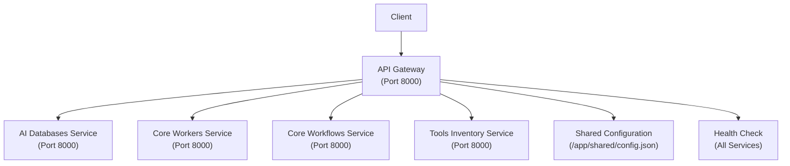

# API Gateway Schema Documentation

## Tổng quan
Tài liệu này mô tả chi tiết schema cho tất cả endpoints của API Gateway trong hệ thống COBOL AI Assistant. API Gateway hoạt động như một proxy layer, routing requests đến các microservices tương ứng.

## Kiến trúc API Gateway



## Base Configuration

### Service URLs
```python
SERVICES = {
    "ai_databases": "http://ai-databases:8000",
    "core_workers": "http://core-workers:8000", 
    "core_workflows": "http://core-workflows:8000",
    "tools_inventory": "http://tools-inventory:8000"
}
```

### Common Headers
```json
{
  "Content-Type": "application/json",
  "Accept": "application/json",
  "User-Agent": "COBOL-AI-Assistant/1.0.0"
}
```

### Common Response Format
```json
{
  "success": true,
  "data": "response_data",
  "error": null,
  "timestamp": "2025-01-27T10:30:00.000Z"
}
```

## V2 API Endpoints

### 1. Gen Specs Endpoints

#### POST /v2/gen-specs
**Mô tả**: Tạo specifications từ file ZIP chứa mã nguồn COBOL

**Request Schema**:
```json
{
  "type": "multipart/form-data",
  "properties": {
    "zip_file": {
      "type": "file",
      "format": "binary",
      "description": "ZIP file containing COBOL source code",
      "required": true,
      "example": "cobol_project.zip"
    }
  }
}
```

**Response Schema**:
```json
{
  "type": "object",
  "properties": {
    "success": {
      "type": "boolean",
      "example": true
    },
    "task_id": {
      "type": "string",
      "format": "uuid",
      "description": "Task ID for status checking",
      "example": "963c87d6-3b20-47b0-a1a5-8daa976a8e10"
    },
    "timestamp": {
      "type": "string",
      "format": "date-time",
      "example": "2025-01-27T10:30:00.000Z"
    }
  },
  "required": ["success", "task_id"]
}
```

**Error Responses**:
```json
{
  "400": {
    "description": "Bad Request",
    "schema": {
      "type": "object",
      "properties": {
        "success": {"type": "boolean", "example": false},
        "error": {"type": "string", "example": "File must be a ZIP file"},
        "timestamp": {"type": "string", "format": "date-time"}
      }
    }
  },
  "504": {
    "description": "Gateway Timeout",
    "schema": {
      "type": "object",
      "properties": {
        "success": {"type": "boolean", "example": false},
        "error": {"type": "string", "example": "Specs generation timeout"},
        "timestamp": {"type": "string", "format": "date-time"}
      }
    }
  }
}
```

#### GET /v2/gen-specs/status/{task_id}
**Mô tả**: Kiểm tra trạng thái của task tạo specifications

**Path Parameters**:
```json
{
  "task_id": {
    "type": "string",
    "format": "uuid",
    "description": "Task ID from gen-specs request",
    "required": true,
    "example": "963c87d6-3b20-47b0-a1a5-8daa976a8e10"
  }
}
```

**Response Schema**:
```json
{
  "type": "object",
  "properties": {
    "task_id": {
      "type": "string",
      "format": "uuid",
      "example": "963c87d6-3b20-47b0-a1a5-8daa976a8e10"
    },
    "state": {
      "type": "string",
      "enum": ["SUCCESS", "PENDING", "FAILURE"],
      "example": "SUCCESS"
    },
    "result": {
      "type": "object",
      "properties": {
        "success": {"type": "boolean", "example": true},
        "error": {"type": "string", "nullable": true, "example": null},
        "timestamp": {"type": "string", "format": "date-time"},
        "request_id": {"type": "string", "format": "uuid"},
        "zip_filename": {"type": "string"},
        "temp_file_path": {"type": "string"},
        "spec_type": {"type": "string", "example": "Repository Overview"},
        "specifications": {"type": "object"},
        "generated_at": {"type": "string", "format": "date-time"},
        "output_path": {"type": "string"},
        "processing_time": {"type": "number", "format": "float"},
        "workflow_completed_at": {"type": "string", "format": "date-time"}
      }
    }
  }
}
```

### 2. Documents Endpoints

#### GET /v2/documents/tree
**Mô tả**: Lấy cấu trúc cây documents

**Query Parameters**:
```json
{
  "project_id": {
    "type": "string",
    "description": "Project ID (optional, uses default if not provided)",
    "required": false,
    "example": "df9391f68d78b76b5aa0cf55621b2023e706f124ae187adcb3794f29875659c0"
  }
}
```

**Response Schema**:
```json
{
  "type": "object",
  "properties": {
    "success": {"type": "boolean", "example": true},
    "project_id": {"type": "string"},
    "sections": {
      "type": "array",
      "items": {
        "type": "object",
        "properties": {
          "id": {"type": "integer", "example": 1},
          "title": {"type": "string", "example": "Repository Overview"},
          "content": {"type": "string"},
          "depth": {"type": "integer", "example": 0},
          "project_id": {"type": "string"},
          "tree": {
            "type": "object",
            "properties": {
              "title": {"type": "string"},
              "content": {"type": "string"},
              "child_content": {"type": "object"}
            }
          }
        }
      }
    },
    "total_sections": {"type": "integer", "example": 1}
  }
}
```

#### GET /v2/documents/tree-md
**Mô tả**: Lấy cấu trúc cây documents dưới dạng file Markdown

**Query Parameters**:
```json
{
  "project_id": {
    "type": "string",
    "description": "Project ID (optional, uses default if not provided)",
    "required": false
  }
}
```

**Response Schema**:
```json
{
  "type": "string",
  "format": "binary",
  "description": "Markdown file download",
  "headers": {
    "Content-Type": "text/markdown",
    "Content-Disposition": "attachment; filename={title}_{project_id[:8]}.md",
    "Content-Length": "integer"
  }
}
```

#### GET /v2/documents/tree-json
**Mô tả**: Lấy cấu trúc cây documents dưới dạng file JSON

**Query Parameters**:
```json
{
  "project_id": {
    "type": "string",
    "description": "Project ID (optional, uses default if not provided)",
    "required": false
  }
}
```

**Response Schema**:
```json
{
  "type": "string",
  "format": "binary",
  "description": "JSON file download",
  "headers": {
    "Content-Type": "application/json",
    "Content-Disposition": "attachment; filename={title}_{project_id[:8]}.json",
    "Content-Length": "integer"
  }
}
```

#### GET /v2/documents/{node_id}
**Mô tả**: Lấy chi tiết của một document node

**Path Parameters**:
```json
{
  "node_id": {
    "type": "integer",
    "description": "Node ID of the section",
    "required": true,
    "example": 123
  }
}
```

**Query Parameters**:
```json
{
  "project_id": {
    "type": "string",
    "description": "Project ID (optional, uses default if not provided)",
    "required": false
  }
}
```

**Response Schema**:
```json
{
  "type": "object",
  "properties": {
    "success": {"type": "boolean", "example": true},
    "section_id": {"type": "integer", "example": 123},
    "project_id": {"type": "string"},
    "tree": {
      "type": "object",
      "properties": {
        "section_id": {"type": "integer"},
        "content": {"type": "string"},
        "title": {"type": "string"},
        "citation": {
          "type": "object",
          "additionalProperties": {
            "type": "object",
            "properties": {
              "start": {"type": "integer"},
              "end": {"type": "integer"},
              "citation_id": {"type": "integer"}
            }
          }
        }
      }
    }
  }
}
```

#### GET /v2/documents/references/{node_id}
**Mô tả**: Lấy references của một document node (chỉ citations)

**Path Parameters**:
```json
{
  "node_id": {
    "type": "integer",
    "description": "Node ID of the section",
    "required": true,
    "example": 123
  }
}
```

**Query Parameters**:
```json
{
  "project_id": {
    "type": "string",
    "description": "Project ID (optional, uses default if not provided)",
    "required": false
  }
}
```

**Response Schema**:
```json
{
  "type": "object",
  "properties": {
    "success": {"type": "boolean", "example": true},
    "section_id": {"type": "integer", "example": 123},
    "project_id": {"type": "string"},
    "tree": {
      "type": "object",
      "description": "Citations only, without content",
      "additionalProperties": {
        "type": "object",
        "properties": {
          "start": {"type": "integer"},
          "end": {"type": "integer"},
          "citation_id": {"type": "integer"}
        }
      }
    }
  }
}
```

### 3. Zoom In Endpoints

#### POST /v2/zoom-in
**Mô tả**: Tạo chi tiết cho một section cụ thể

**Request Schema**:
```json
{
  "type": "multipart/form-data",
  "properties": {
    "repo_path": {
      "type": "string",
      "description": "Repository path (optional, uses default if not provided)",
      "required": false,
      "example": "/app/shared/temp/specs_v2_Archive"
    },
    "section_id": {
      "type": "integer",
      "description": "Section ID to zoom into",
      "required": true,
      "example": 1
    },
    "query": {
      "type": "string",
      "description": "Query for detailed generation",
      "required": false,
      "default": "Describe more",
      "example": "Describe more details about this section"
    }
  }
}
```

**Response Schema**:
```json
{
  "type": "object",
  "properties": {
    "success": {"type": "boolean", "example": true},
    "task_id": {
      "type": "string",
      "format": "uuid",
      "example": "963c87d6-3b20-47b0-a1a5-8daa976a8e10"
    }
  }
}
```

#### GET /v2/zoom-in/status/{task_id}
**Mô tả**: Kiểm tra trạng thái của zoom-in task

**Path Parameters**:
```json
{
  "task_id": {
    "type": "string",
    "format": "uuid",
    "description": "Task ID from zoom-in request",
    "required": true
  }
}
```

**Response Schema**:
```json
{
  "type": "object",
  "properties": {
    "success": {"type": "boolean", "example": true},
    "task_id": {"type": "string", "format": "uuid"},
    "status": {
      "type": "string",
      "enum": ["IN PROGRESS", "COMPLETED", "FAILED"],
      "example": "COMPLETED"
    },
    "result": {"type": "object"},
    "error": {"type": "string", "nullable": true},
    "message": {"type": "string"},
    "section_id": {"type": "string", "description": "Extracted from result if completed"}
  }
}
```

#### POST /v2/zoom-in-agenda
**Mô tả**: Tạo chi tiết cho nhiều section theo agenda

**Request Schema**:
```json
{
  "type": "multipart/form-data",
  "properties": {
    "repo_path": {
      "type": "string",
      "description": "Repository path (optional, uses default if not provided)",
      "required": false,
      "example": "/app/shared/temp/specs_v2_Archive"
    },
    "section_id": {
      "type": "integer",
      "description": "Section ID to zoom into",
      "required": true,
      "example": 1
    },
    "agenda_query": {
      "type": "string",
      "description": "Query for agenda generation",
      "required": false,
      "default": "Generate comprehensive analysis agenda",
      "example": "Generate comprehensive analysis agenda for this section"
    }
  }
}
```

**Response Schema**:
```json
{
  "type": "object",
  "properties": {
    "success": {"type": "boolean", "example": true},
    "task_id": {
      "type": "string",
      "format": "uuid",
      "example": "agenda-123e4567-e89b-12d3-a456-426614174000"
    },
    "agenda_items": {
      "type": "array",
      "items": {"type": "string"},
      "example": ["Data validation and error handling mechanisms", "File processing workflow and batch logic"]
    },
    "total_items": {"type": "integer", "example": 5},
    "status": {"type": "string", "example": "IN PROGRESS"},
    "message": {"type": "string", "example": "Agenda generated successfully, processing zoom-in sections"}
  }
}
```

#### GET /v2/zoom-in-agenda/status/{task_id}
**Mô tả**: Kiểm tra trạng thái của agenda-based zoom-in task

**Path Parameters**:
```json
{
  "task_id": {
    "type": "string",
    "format": "uuid",
    "description": "Task ID from zoom-in-agenda request",
    "required": true
  }
}
```

**Response Schema**:
```json
{
  "type": "object",
  "properties": {
    "success": {"type": "boolean", "example": true},
    "task_id": {"type": "string", "format": "uuid"},
    "status": {
      "type": "string",
      "enum": ["IN PROGRESS", "COMPLETED", "FAILED"],
      "example": "COMPLETED"
    },
    "agenda_items": {
      "type": "array",
      "items": {"type": "string"}
    },
    "generated_sections": {
      "type": "array",
      "items": {
        "type": "object",
        "properties": {
          "section_id": {"type": "integer", "example": 101},
          "title": {"type": "string"},
          "agenda_item": {"type": "string"},
          "success": {"type": "boolean", "example": true},
          "generated_at": {"type": "string", "format": "date-time"}
        }
      }
    },
    "completed_items": {"type": "integer", "example": 3},
    "total_items": {"type": "integer", "example": 3},
    "progress_percentage": {"type": "number", "format": "float", "example": 100.0},
    "error": {"type": "string", "nullable": true},
    "message": {"type": "string"},
    "section_ids": {
      "type": "array",
      "items": {"type": "string"},
      "description": "Extracted from generated_sections if completed"
    }
  }
}
```

### 4. Indexing Endpoints

#### POST /v2/index-tree
**Mô tả**: Index toàn bộ cây sections

**Request Schema**:
```json
{
  "type": "multipart/form-data",
  "properties": {
    "section_id": {
      "type": "integer",
      "description": "Section ID to index",
      "required": true,
      "example": 1
    },
    "project_id": {
      "type": "string",
      "description": "Project ID (optional, uses default if not provided)",
      "required": false,
      "example": "a1b2c3d4e5f6789012345678901234567890abcd"
    }
  }
}
```

**Response Schema**:
```json
{
  "type": "object",
  "properties": {
    "success": {"type": "boolean", "example": true},
    "task_id": {
      "type": "string",
      "format": "uuid",
      "example": "a330a3b7-42d6-41d6-94c8-0895dd809ca6"
    },
    "status": {"type": "string", "example": "IN PROGRESS"},
    "message": {"type": "string", "example": "Section index-tree task submitted successfully"}
  }
}
```

#### GET /v2/index-tree/status/{task_id}
**Mô tả**: Kiểm tra trạng thái của index-tree task

**Path Parameters**:
```json
{
  "task_id": {
    "type": "string",
    "format": "uuid",
    "description": "Task ID from index-tree request",
    "required": true
  }
}
```

**Response Schema**:
```json
{
  "type": "object",
  "properties": {
    "success": {"type": "boolean", "example": true},
    "task_id": {"type": "string", "format": "uuid"},
    "status": {
      "type": "string",
      "enum": ["IN PROGRESS", "COMPLETED", "FAILED"],
      "example": "COMPLETED"
    },
    "result": {
      "type": "object",
      "properties": {
        "success": {"type": "boolean", "example": true},
        "indexed_count": {"type": "integer", "example": 1},
        "sections_count": {"type": "integer", "example": 1},
        "sections": {"type": "array", "items": {"type": "integer"}}
      }
    },
    "error": {"type": "string", "nullable": true},
    "message": {"type": "string"}
  }
}
```

#### POST /v2/index-node
**Mô tả**: Index một node cụ thể (không bao gồm children)

**Request Schema**:
```json
{
  "type": "multipart/form-data",
  "properties": {
    "node_id": {
      "type": "integer",
      "description": "Node ID to index",
      "required": true,
      "example": 1
    },
    "project_id": {
      "type": "string",
      "description": "Project ID (optional, uses default if not provided)",
      "required": false,
      "example": "a1b2c3d4e5f6789012345678901234567890abcd"
    }
  }
}
```

**Response Schema**:
```json
{
  "type": "object",
  "properties": {
    "success": {"type": "boolean", "example": true},
    "task_id": {
      "type": "string",
      "format": "uuid",
      "example": "a330a3b7-42d6-41d6-94c8-0895dd809ca6"
    },
    "status": {"type": "string", "example": "IN PROGRESS"},
    "message": {"type": "string", "example": "Section index-node task submitted successfully"}
  }
}
```

#### GET /v2/index-node/status/{task_id}
**Mô tả**: Kiểm tra trạng thái của index-node task

**Path Parameters**:
```json
{
  "task_id": {
    "type": "string",
    "format": "uuid",
    "description": "Task ID from index-node request",
    "required": true
  }
}
```

**Response Schema**: Tương tự như index-tree status

#### POST /v2/index-zip
**Mô tả**: Index file ZIP chứa source code

**Request Schema**:
```json
{
  "type": "multipart/form-data",
  "properties": {
    "zip_file": {
      "type": "file",
      "format": "binary",
      "description": "ZIP file containing COBOL source code",
      "required": true
    },
    "chunk_size": {
      "type": "integer",
      "description": "Chunk size for processing",
      "required": false,
      "default": 6000
    },
    "batch_size": {
      "type": "integer",
      "description": "Batch size for indexing",
      "required": false,
      "default": 100
    },
    "hash_dir": {
      "type": "string",
      "description": "Hash directory (optional)",
      "required": false
    }
  }
}
```

**Response Schema**:
```json
{
  "type": "object",
  "properties": {
    "success": {"type": "boolean", "example": true},
    "task_id": {
      "type": "string",
      "format": "uuid",
      "example": "a330a3b7-42d6-41d6-94c8-0895dd809ca6"
    },
    "timestamp": {"type": "string", "format": "date-time"}
  }
}
```

#### GET /v2/index-zip/status/{task_id}
**Mô tả**: Kiểm tra trạng thái của index-zip task

**Path Parameters**:
```json
{
  "task_id": {
    "type": "string",
    "format": "uuid",
    "description": "Task ID from index-zip request",
    "required": true
  }
}
```

**Response Schema**: Tương tự như các status endpoints khác

### 5. QA Endpoints

#### POST /v2/qa
**Mô tả**: Submit câu hỏi và tạo QA tasks

**Request Schema**:
```json
{
  "type": "multipart/form-data",
  "properties": {
    "question": {
      "type": "string",
      "description": "Question to ask",
      "required": true,
      "example": "What is the main function of JHC001?"
    }
  }
}
```

**Response Schema**:
```json
{
  "type": "object",
  "properties": {
    "retrieval_task_id": {
      "type": "string",
      "format": "uuid",
      "description": "ID of the retrieval task",
      "example": "12345-abcde-67890-fghij"
    },
    "generate_task_id": {
      "type": "string",
      "format": "uuid",
      "description": "ID of the answer generation task",
      "example": "67890-fghij-12345-abcde"
    }
  }
}
```

#### GET /v2/qa/{retrieval_task_id}/references
**Mô tả**: Lấy references từ retrieval task

**Path Parameters**:
```json
{
  "retrieval_task_id": {
    "type": "string",
    "format": "uuid",
    "description": "Retrieval task ID from QA request",
    "required": true
  }
}
```

**Response Schema**:
```json
{
  "type": "object",
  "properties": {
    "status": {
      "type": "string",
      "enum": ["PENDING", "SUCCESS", "FAILURE"],
      "example": "SUCCESS"
    },
    "references": {
      "type": "object",
      "description": "Reference documents grouped by collection",
      "additionalProperties": {
        "type": "array",
        "items": {
          "type": "object",
          "properties": {
            "content": {"type": "string"},
            "file_path": {"type": "string"},
            "score": {"type": "number", "format": "float"},
            "metadata": {
              "type": "object",
              "properties": {
                "start_line": {"type": "integer"},
                "end_line": {"type": "integer"},
                "division": {"type": "string"}
              }
            }
          }
        }
      }
    }
  }
}
```

#### GET /v2/qa/{generate_task_id}
**Mô tả**: Lấy answer từ generation task

**Path Parameters**:
```json
{
  "generate_task_id": {
    "type": "string",
    "format": "uuid",
    "description": "Generation task ID from QA request",
    "required": true
  }
}
```

**Response Schema**:
```json
{
  "type": "object",
  "properties": {
    "status": {
      "type": "string",
      "enum": ["PENDING", "SUCCESS", "FAILURE"],
      "example": "SUCCESS"
    },
    "answer": {
      "type": "string",
      "description": "Generated answer",
      "example": "Based on the COBOL programs analyzed, JHC001 is the main program..."
    },
    "error": {"type": "string", "nullable": true}
  }
}
```

### 6. Diagram Endpoints

#### POST /v2/generate-diagram-zoom-in
**Mô tả**: Tạo diagram zoom-in analysis

**Request Schema**:
```json
{
  "type": "multipart/form-data",
  "properties": {
    "section_id": {
      "type": "string",
      "description": "Section ID containing the diagram",
      "required": true,
      "example": "123"
    },
    "diagram_id": {
      "type": "string",
      "description": "Diagram ID to analyze",
      "required": true,
      "example": "456"
    },
    "node_name": {
      "type": "string",
      "description": "Name of the node to zoom into",
      "required": true,
      "example": "ProcessData"
    },
    "query": {
      "type": "string",
      "description": "Query to zoom into",
      "required": false,
      "default": "",
      "example": "Analyze this node in detail"
    }
  }
}
```

**Response Schema**:
```json
{
  "type": "object",
  "properties": {
    "success": {"type": "boolean", "example": true},
    "task_id": {
      "type": "string",
      "format": "uuid",
      "example": "diagram-789-abc-def"
    },
    "timestamp": {"type": "string", "format": "date-time"},
    "api_version": {"type": "string", "example": "v2"}
  }
}
```

#### GET /v2/generate-diagram-zoom-in/status/{task_id}
**Mô tả**: Kiểm tra trạng thái của diagram zoom-in task

**Path Parameters**:
```json
{
  "task_id": {
    "type": "string",
    "format": "uuid",
    "description": "Task ID from diagram zoom-in request",
    "required": true
  }
}
```

**Response Schema**:
```json
{
  "type": "object",
  "properties": {
    "success": {"type": "boolean", "example": true},
    "task_id": {"type": "string", "format": "uuid"},
    "status": {
      "type": "string",
      "enum": ["IN PROGRESS", "COMPLETED", "FAILED"],
      "example": "COMPLETED"
    },
    "result": {
      "type": "object",
      "properties": {
        "success": {"type": "boolean", "example": true},
        "section_id": {"type": "string", "example": "789"},
        "title": {"type": "string", "example": "456_ProcessData (1)"},
        "content": {"type": "string"}
      }
    },
    "timestamp": {"type": "string", "format": "date-time"},
    "api_version": {"type": "string", "example": "v2"}
  }
}
```

#### GET /v2/get_diagram
**Mô tả**: Lấy diagram code theo diagram_id

**Query Parameters**:
```json
{
  "diagram_id": {
    "type": "string",
    "description": "Diagram ID to retrieve",
    "required": true,
    "example": "456"
  }
}
```

**Response Schema**:
```json
{
  "type": "object",
  "properties": {
    "success": {"type": "boolean", "example": true},
    "diagram_id": {"type": "string", "example": "456"},
    "data": {
      "type": "object",
      "properties": {
        "id": {"type": "integer", "example": 456},
        "section_id": {"type": "integer", "example": 123},
        "mermaid_code": {"type": "string"},
        "project_id": {"type": "string", "example": "project_1"}
      }
    },
    "mermaid_code": {"type": "string"},
    "linked_sections": {
      "type": "array",
      "items": {
        "type": "object",
        "properties": {
          "section_id": {"type": "integer", "example": 789},
          "section_name": {"type": "string", "example": "main_process"},
          "section_title": {"type": "string", "example": "Main Process Overview"},
          "section_depth": {"type": "integer", "example": 1},
          "link_type": {"type": "string", "example": "diagram"},
          "link_project_id": {"type": "string", "example": "project_1"}
        }
      }
    },
    "total_linked_sections": {"type": "integer", "example": 1},
    "message": {"type": "string", "example": "Diagram retrieved successfully with 1 linked sections"},
    "timestamp": {"type": "string", "format": "date-time"},
    "api_version": {"type": "string", "example": "v2"}
  }
}
```

### 7. Configuration Endpoints

#### GET /config
**Mô tả**: Lấy configuration hiện tại

**Response Schema**:
```json
{
  "type": "object",
  "properties": {
    "parsers": {
      "type": "object",
      "properties": {
        "cobol": {
          "type": "object",
          "properties": {
            "max_chunk_size": {"type": "integer", "example": 6000}
          }
        },
        "copy": {
          "type": "object",
          "properties": {
            "max_chunk_size": {"type": "integer", "example": 6000}
          }
        },
        "jcl": {
          "type": "object",
          "properties": {
            "max_chunk_size": {"type": "integer", "example": 6000}
          }
        },
        "text": {
          "type": "object",
          "properties": {
            "max_chunk_size": {"type": "integer", "example": 3000},
            "overlap_chunk_size": {"type": "integer", "example": 300}
          }
        }
      }
    },
    "embedding": {
      "type": "object",
      "properties": {
        "model_name": {"type": "string", "example": "text-embedding-ada-002"},
        "max_input_length": {"type": "integer", "example": 8191}
      }
    },
    "llm_services": {
      "type": "object",
      "properties": {
        "qa_tool": {
          "type": "object",
          "properties": {
            "model_name": {"type": "string", "example": "gpt-4.1"},
            "max_tokens": {"type": "integer", "example": 1000},
            "temperature": {"type": "number", "format": "float", "example": 0.3}
          }
        },
        "summary_tool": {
          "type": "object",
          "properties": {
            "model_name": {"type": "string", "example": "gpt-4.1"},
            "max_tokens": {"type": "integer", "example": 500},
            "temperature": {"type": "number", "format": "float", "example": 0.3}
          }
        },
        "specs_tool": {
          "type": "object",
          "properties": {
            "model_name": {"type": "string", "example": "gpt-4.1"},
            "max_tokens": {"type": "integer", "example": 8000},
            "temperature": {"type": "number", "format": "float", "example": 0.3}
          }
        }
      }
    }
  }
}
```

#### PUT /config
**Mô tả**: Cập nhật configuration

**Request Schema**:
```json
{
  "type": "object",
  "properties": {
    "parsers": {
      "type": "object",
      "description": "Parser configurations"
    },
    "embedding": {
      "type": "object",
      "description": "Embedding configurations"
    },
    "llm_services": {
      "type": "object",
      "description": "LLM service configurations"
    }
  },
  "additionalProperties": true
}
```

**Response Schema**:
```json
{
  "type": "object",
  "properties": {
    "success": {"type": "boolean", "example": true},
    "timestamp": {"type": "string", "format": "date-time"}
  }
}
```

#### GET /health
**Mô tả**: Kiểm tra health status của API Gateway và tất cả services

**Response Schema**:
```json
{
  "type": "object",
  "properties": {
    "success": {"type": "boolean", "example": true},
    "status": {
      "type": "string",
      "enum": ["healthy", "unhealthy", "error", "degraded"],
      "example": "healthy"
    },
    "service": {"type": "string", "example": "api_gateway"},
    "dependencies": {
      "type": "object",
      "properties": {
        "ai_databases": {
          "type": "string",
          "enum": ["healthy", "unhealthy", "unreachable"],
          "example": "healthy"
        },
        "core_workers": {
          "type": "string",
          "enum": ["healthy", "unhealthy", "unreachable"],
          "example": "healthy"
        },
        "core_workflows": {
          "type": "string",
          "enum": ["healthy", "unhealthy", "unreachable"],
          "example": "healthy"
        },
        "tools_inventory": {
          "type": "string",
          "enum": ["healthy", "unhealthy", "unreachable"],
          "example": "healthy"
        }
      }
    }
  }
}
```

#### GET /services
**Mô tả**: Lấy danh sách services và URLs

**Response Schema**:
```json
{
  "type": "object",
  "properties": {
    "ai_databases": {"type": "string", "example": "http://ai-databases:8000"},
    "core_workers": {"type": "string", "example": "http://core-workers:8000"},
    "core_workflows": {"type": "string", "example": "http://core-workflows:8000"},
    "tools_inventory": {"type": "string", "example": "http://tools-inventory:8000"}
  }
}
```

## Error Handling

### Common Error Response Schema
```json
{
  "type": "object",
  "properties": {
    "success": {"type": "boolean", "example": false},
    "error": {"type": "string", "description": "Error message"},
    "error_code": {"type": "string", "description": "Error code"},
    "timestamp": {"type": "string", "format": "date-time"},
    "service": {"type": "string", "description": "Service that generated the error"},
    "path": {"type": "string", "description": "Request path"}
  }
}
```

### HTTP Status Codes
- `200`: Success
- `400`: Bad Request (validation errors)
- `404`: Not Found (missing resources)
- `422`: Unprocessable Entity (validation errors)
- `500`: Internal Server Error
- `503`: Service Unavailable
- `504`: Gateway Timeout

### Validation Error Schema
```json
{
  "type": "object",
  "properties": {
    "detail": {
      "type": "array",
      "items": {
        "type": "object",
        "properties": {
          "loc": {
            "type": "array",
            "items": {"type": "string"},
            "description": "Location of the error"
          },
          "msg": {"type": "string", "description": "Error message"},
          "type": {"type": "string", "description": "Error type"}
        }
      }
    }
  }
}
```

## Authentication & Authorization

### Current Status
- **Authentication**: Không có authentication hiện tại
- **Authorization**: Không có authorization hiện tại
- **CORS**: Enabled cho tất cả origins

### CORS Configuration
```python
app.add_middleware(
    CORSMiddleware,
    allow_origins=["*"],
    allow_credentials=True,
    allow_methods=["*"],
    allow_headers=["*"],
)
```

## Rate Limiting

### Current Status
- **Rate Limiting**: Không có rate limiting hiện tại
- **Request Timeout**: 120s cho proxy requests
- **Task Timeout**: 60-900s tùy theo loại task

## Monitoring & Logging

### Logging Configuration
```python
# Log file location
log_file_path = "/app/shared/api_gateway.log"

# Log format
formatter = logging.Formatter(
    '%(asctime)s - %(name)s - %(levelname)s - %(filename)s:%(lineno)d - %(funcName)s - %(message)s'
)
```

### Health Check Endpoints
- **Gateway Health**: `/health`
- **Service Health**: Individual service health checks
- **Dependencies**: All service dependencies status

## Performance Considerations

### Timeouts
- **Proxy Requests**: 120s
- **Task Submission**: 60s
- **Task Processing**: 600-900s
- **Health Checks**: 5s per service

### Async Processing
- **Celery Tasks**: Background processing
- **Streaming**: Large file downloads
- **Batch Processing**: Multiple operations

### Caching
- **Configuration**: In-memory caching
- **Service URLs**: Static configuration
- **Health Status**: Periodic health checks

---

## Liên kết tài liệu

- [API Flow Documentation](./README.md)
- [Gen Specs Flow](./01_gen_specs_flow.md)
- [Documents Tree Flow](./02_documents_tree_flow.md)
- [Document Node Flow](./03_document_node_flow.md)
- [Zoom In Flow](./04_zoom_in_flow.md)
- [Indexing Flow](./05_indexing_flow.md)
- [QA Flow](./06_qa_flow.md)
- [Diagram Flow](./07_diagram_flow.md)
- [Configuration Flow](./08_configuration_flow.md)
