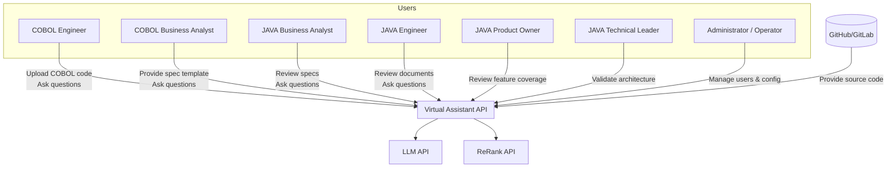
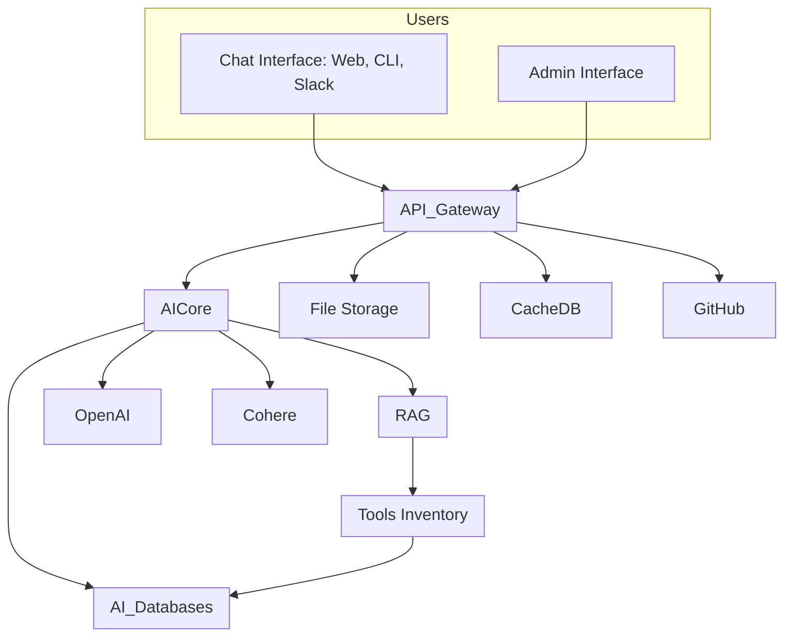
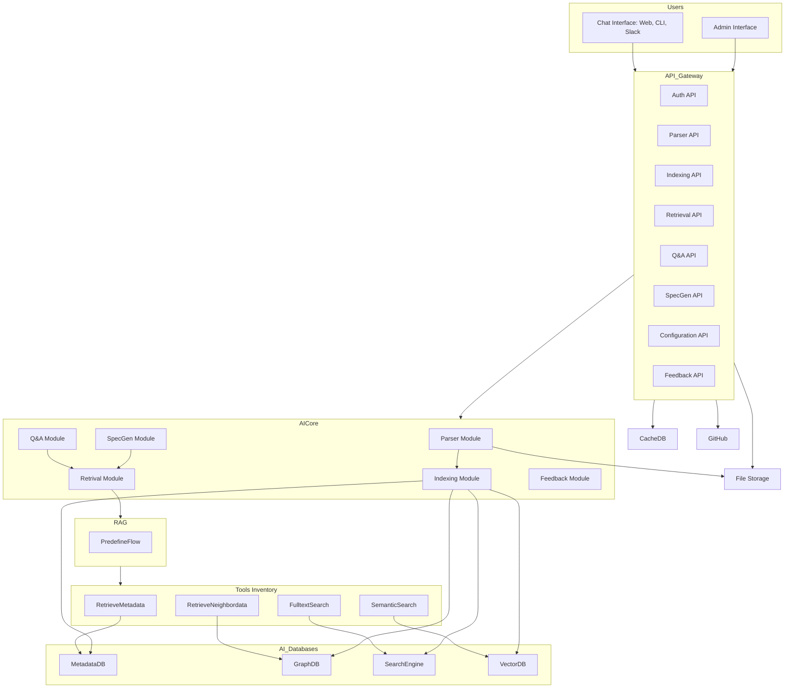

# COBOL to JAVA Virtual Assistant API

# 🧭 Level 1: System Context

## 🔷 System Overview

### Virtual Assistant API
A backend API package acting as a virtual assistant for the team involved in migrating legacy COBOL systems to modern JAVA systems.

---

## 👥 Primary Users

| Role                    | Responsibilities                                                                 |
|-------------------------|----------------------------------------------------------------------------------|
| **COBOL Engineer (COBOL-E)**     | Provides COBOL source code and clarifies legacy system behavior               |
| **COBOL Business Analyst (COBOL-BA)** | Prepares specs/documents from COBOL understanding                             |
| **JAVA Business Analyst (JAVA-BA)**   | Writes specs for JAVA system; aligns with COBOL-BA                             |
| **JAVA Engineer (JAVA-E)**       | Develops JAVA system based on translated documents/specs                      |
| **JAVA Product Owner (JAVA-PO)** | Ensures delivery matches business expectations                               |
| **JAVA Technical Leader (JAVA-TL)**   | Oversees architecture and dev best practices                                  |
| **Administrator/Operator**      | Manages accounts, configures and fine-tunes the Virtual Assistant             |

---

## 🎯 System Goals

- Parse and analyze COBOL source code (via GitHub/GitLab or ZIP upload)
- Assist in building documentation/specs for JAVA migration
- Act as a central knowledge assistant to answer team questions
- Enable cross-role collaboration through shared understanding of legacy code

---

## 🔗 External Systems

- **GitHub/GitLab (Optional):** For accessing COBOL source repositories
- **LLM API**
- **ReRank API**

## 🖼️ Diagram

# 📦 Level 2: Container

## 🧱 Containers Overview

| Container             | Description                                                                 |
|-----------------------|-----------------------------------------------------------------------------|
| **Backend API**       | Core interface exposing REST endpoints to clients and handling user interaction logic |
| **Database**          | Stores structured metadata, user data, chat logs, etc. (PostgreSQL)         |
| **File Storage**      | Stores uploaded COBOL files or intermediary assets                          |
| **AI Core Processor** | Executes pre-defined workflows or agent-based strategies; interfaces with the RAG framework |
| **RAG Framework (Dify)** | Responsible for retrieval-augmented generation and agent orchestration     |
| **Tools Inventory**   | Provides tool services used by RAG via HTTP |

---

## 🎮 Interaction Channels

| Role           | Interface                                                         |
|----------------|--------------------------------------------------------------------|
| **End Users**      | Chat Interface (CLI, Web, Slack, etc.)                           |
| **Admin/Operator** | Admin Page for managing config, access, feedback loop, etc.       |

---

## 🌐 External Services

| Service        | Purpose                                           |
|----------------|---------------------------------------------------|
| **File storage** | File Storage Service                            |
| **Redis**      | Caching layer                                     |
| **OpenAI API** | External LLM processing                           |
| **Cohere API** | Re-ranking relevant document                      |
| **GitHub API** | Retrieve COBOL source from repositories           |

---

## 🖼️ Mermaid: Container Diagram

# 🧩 Level 3: Component

## 🧱 API Gateway

- **Auth API** – Manage authentication/authorization  
- **Parser API** – Parse and structure COBOL source code  
- **Indexing API** – Index data to metadata DB, graph, search, and vector DBs  
- **Retrieval API** – Query and fetch indexed data  
- **Q&A API** – Handles team queries about code/specs using LLM
- **Spec Gen API** – Generates migration specs from COBOL code  
- **Configuration API** – Manage system behavior and workflows  
- **Feedback API** – Collect user feedback for continuous improvement  

---

## ⚙️ AI Core Processor
- **Spec Gen Module** – Execute Retrieve Pipeline for generate Specs
- **Q&A Module** – Execute Retrieve Pipeline for Q&A Module & generate answer
- **Retrieval Module** – Request to RAG pipelines
- **Parser Module** – Parsing Cobol Repo to appropriate formated document
- **Indexing Module** – Indexing document to Databases
- **Feedback Module** – Processing feedback from user

## 🔍 RAG Framework
- **Pre-defined Pipelines** – Processing feedback from user

## 🧰 Tools Inventory
- **Semantic Search** – Search VectorDB
- **Graph Search** - Search GraphDB
- **Metadata Search** - Search Metadata
- **Fulltext Search** - Execute Search Engine
- ...

## 🧠 AI_Databases
- **Metadata Database** – Store metadata of document, chunk, file,...
- **Graph Database** – Store relationship among variable, chunk, file,...
- **Search Engine** – Store raw text for searching by keyword/term
- **Vector Database** – Store vector of chunk/term to do semantic search

## 🖼️ Mermaid: Container Diagram

