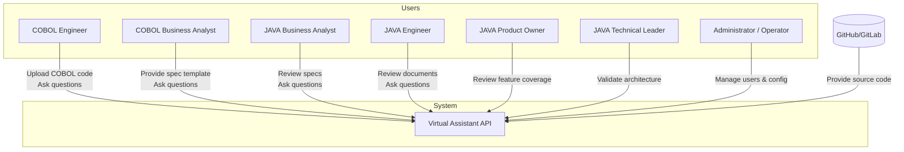

# COBOL to JAVA Virtual Assistant API

# 🧭 Level 1: System Context

## 🔷 System Overview

### Virtual Assistant API
A backend API package acting as a virtual assistant for the team involved in migrating legacy COBOL systems to modern JAVA systems.

---

## 👥 Primary Users

| Role                    | Responsibilities                                                                 |
|-------------------------|----------------------------------------------------------------------------------|
| **COBOL Engineer (COBOL-E)**     | Provides COBOL source code and clarifies legacy system behavior               |
| **COBOL Business Analyst (COBOL-BA)** | Prepares specs/documents from COBOL understanding                             |
| **JAVA Business Analyst (JAVA-BA)**   | Writes specs for JAVA system; aligns with COBOL-BA                             |
| **JAVA Engineer (JAVA-E)**       | Develops JAVA system based on translated documents/specs                      |
| **JAVA Product Owner (JAVA-PO)** | Ensures delivery matches business expectations                               |
| **JAVA Technical Leader (JAVA-TL)**   | Oversees architecture and dev best practices                                  |
| **Administrator/Operator**      | Manages accounts, configures and fine-tunes the Virtual Assistant             |

---

## 🎯 System Goals

- Parse and analyze COBOL source code (via GitHub/GitLab or ZIP upload)
- Assist in building documentation/specs for JAVA migration
- Act as a central knowledge assistant to answer team questions
- Enable cross-role collaboration through shared understanding of legacy code

---

## 🔗 External Systems

- **GitHub/GitLab (Optional):** For accessing COBOL source repositories

## 🖼️ Diagram

