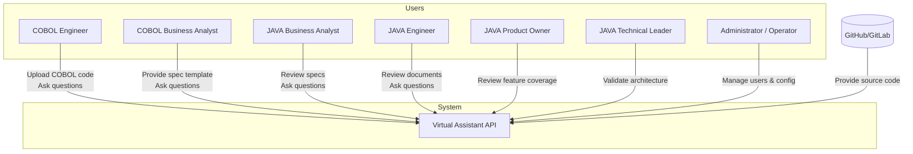
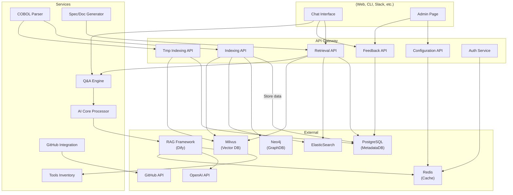

# COBOL to JAVA Virtual Assistant API

# 🧭 Level 1: System Context

## 🔷 System Overview

### Virtual Assistant API
A backend API package acting as a virtual assistant for the team involved in migrating legacy COBOL systems to modern JAVA systems.

---

## 👥 Primary Users

| Role                    | Responsibilities                                                                 |
|-------------------------|----------------------------------------------------------------------------------|
| **COBOL Engineer (COBOL-E)**     | Provides COBOL source code and clarifies legacy system behavior               |
| **COBOL Business Analyst (COBOL-BA)** | Prepares specs/documents from COBOL understanding                             |
| **JAVA Business Analyst (JAVA-BA)**   | Writes specs for JAVA system; aligns with COBOL-BA                             |
| **JAVA Engineer (JAVA-E)**       | Develops JAVA system based on translated documents/specs                      |
| **JAVA Product Owner (JAVA-PO)** | Ensures delivery matches business expectations                               |
| **JAVA Technical Leader (JAVA-TL)**   | Oversees architecture and dev best practices                                  |
| **Administrator/Operator**      | Manages accounts, configures and fine-tunes the Virtual Assistant             |

---

## 🎯 System Goals

- Parse and analyze COBOL source code (via GitHub/GitLab or ZIP upload)
- Assist in building documentation/specs for JAVA migration
- Act as a central knowledge assistant to answer team questions
- Enable cross-role collaboration through shared understanding of legacy code

---

## 🔗 External Systems

- **GitHub/GitLab (Optional):** For accessing COBOL source repositories

## 🖼️ Diagram

# 🧱 C4 Level 2: Container – "COBOL to JAVA Virtual Assistant API"

## 📦 Containers in the System

| Container                 | Description                                                        |
|---------------------------|--------------------------------------------------------------------|
| **API Gateway**           | Entry point for all API calls (authentication, routing)            |
| **Indexing API**          | Parses and indexes COBOL source code into multiple data stores     |
| **Memory API**      | Indexes intermediate/inferred user/system data                     |
| **Retrieval API**         | Retrieves indexed content for answering user questions             |
| **Configuration API**     | Admin-facing API to configure system behavior                      |
| **Feedback API**          | Collects feedback to improve assistant performance                 |
| **Auth Service**          | Handles authentication and authorization                           |
| **COBOL Parser**          | Extracts information from COBOL code                               |
| **Spec/Doc Generator**    | Builds specs/docs from parsed data                                 |
| **Q&A Engine**            | Responds to questions using data from storage and LLM              |
| **GitHub Integration Service** | Interacts with GitHub for code access                         |
| **AI Core Processor**     | Orchestrates calls to RAG framework or agent-based workflow        |
| **RAG Framework (Dify)**  | External orchestrator for Retrieval-Augmented Generation           |
| **Tools Inventory**       | Provides tools invoked via HTTP for the RAG engine                 |
| **Admin Page**            | Interface for Admins to manage system                              |
| **Chat Interface**        | Interface where end-users interact with the assistant              |

---

## 🗃️ Databases / External Services

| Service              | Role                                                                |
|----------------------|---------------------------------------------------------------------|
| **PostgreSQL (MetadataDB)** | Stores structured metadata about COBOL system                 |
| **Neo4j (GraphDB)**         | Stores relationships between entities/features/modules        |
| **ElasticSearch**           | Full-text search index for COBOL code and docs                |
| **Milvus (VectorDB)**       | Stores embeddings for semantic search                         |
| **Redis**                   | Caching for performance                                       |
| **OpenAI API**              | Language model for answering and reasoning                    |
| **GitHub API**              | Source for COBOL code (optional)                              |

---

## 👨‍💻 User Interfaces

- **Chat Interface**: Used by COBOL-E, COBOL-BA, JAVA-BA, JAVA-E, JAVA-TL, JAVA-PO  
- **Admin Page**: Used by Administrator/Operator

---

## 🖼️ Mermaid: Container Diagram

