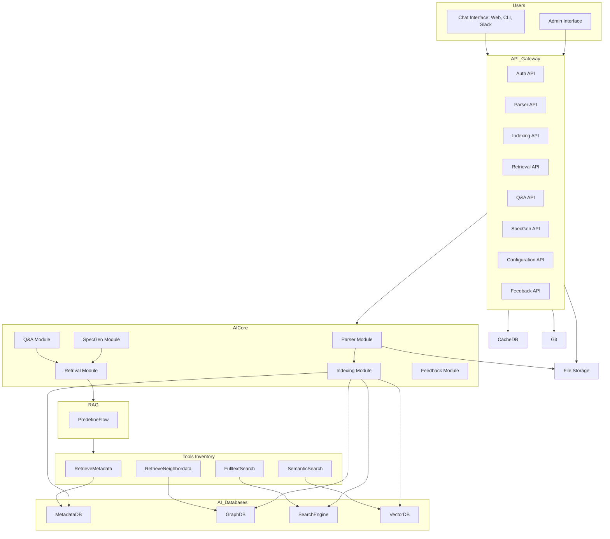

# Architecture

# Strategy
- Decompose the entire Assistant system into services and modules
> Enables encapsulation and accelerates development by allowing more engineers to contribute concurrently.
- Deliver full end-to-end flow early
> Allows clients to begin testing as soon as possible.
- Inject human knowledge to handle AI uncertainty
> Helps identify inefficient steps and replace them with human expertise when necessary.
- Leveraging feedback loops
> Progressively enhance system efficiency

# Sprint 1:
- Finalize 
