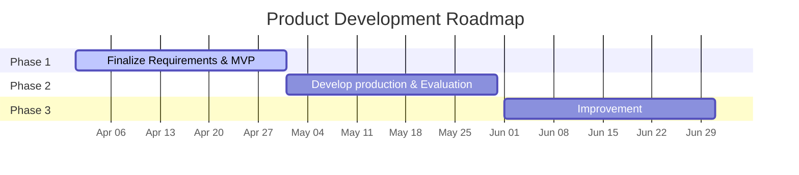
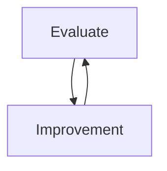

# General Strategy
- Decompose the entire Assistant system into services and modules
> Enables encapsulation and accelerates development by allowing more engineers to contribute concurrently.
- Deliver full end-to-end flow early
> Allows clients to begin testing as soon as possible.
- Inject human knowledge to handle AI uncertainty (_inject knowledge on devtime_)
> Helps identify inefficient steps and replace them with human expertise when necessary.
- Leveraging feedback loops (_inject knowledge on runtime_)
> Progressively enhance system efficiency

# Roadmap

## Phase 1: Finalize product requirement & MVP (1st month)
- Answer the questions:
    - Who is the user?
      
      -> Which problems does the Assistant solve?
      
      -> Which feature that the Assistant will have?
        - Extract Knowledge from COBOL source code (_create & upload by COBOL-E_)
        - Answer Q&A about the **Extracted Knowledge from COBOL** (_COBOL-E, COBOL-BA_)
        - Extract Knowledge from Document Specs (_create & upload by COBOL-BA_)
        - Answer Q&A about the **Extracted Knowledge from Document Specs** (_JAVA-E, JAVA-Lead, JAVA-PO, JAVA-BA_)
        - Authentication/Authorization/Configuration setting (_configure by Admin_)
        - Utility features: (_All type of user_)
            - Auto translate Japanese <-> Vietnamese
            - ...
            
    - How user interact with the Assistant?
      
      -> Define userflow
- System & Solution Design
- Build MVP
    - Upload COBOL zip file 
    - Extract Knowledge from COBOL source code (simply summarizing each COBOL file content & indexing to database) 
    - Q&A on Extract Knowledge from COBOL source code (COBOL-E, COBOL-BA) 
    - Basic configuration (switch API vendor) 

## Phase 2: Develop production & Evaluation
- Evaluation type:
    - Actor:
        - Human: COBOL-E or COBOL-BA
        - Assistant
    - Automatically: preparing pairs of Question + Answer of COBOL-E & COBOL-BA
        - Ask question on UI/API & get Answer (by Assistant)
        - Perpare Golden Answer (by Human)

      => Auto evaluate by LLM
      
    - Manually: vote like/dislike on UI (by Human)
- Evaluation target:
    - Context-hit rate: Assistant successfully retrieved relevant context
    - Accuracy rate: Assistant provides correct answers
- Develop production base on finalized feature provide by Phase 1

## Phase 3: Improvement
- Iteratively evaluate and improve the Assistant answers

