# Evaluation Flow
## 1. Manually Review Flow
- Human: Ask a question
- Assistant: Provide answer and references to it
  - File Path
  - Source code
- Human: Verify answer base on references
  - Verify reference is relevant
  - Verify the answer is appropriate and not hallucinate
  - Write down incorrect point.

## 2. Hit Rate Evaluation Flow

```mermaid
sequenceDiagram
    participant Human
    participant Assistant
    participant AIExpert

    Human->>Assistant: Ask a question
    Assistant->>Assistant: Retrieve potential references
    Assistant-->>Human: Provide answer + list of references (top-N)
    Human->>Human: Check if any provided reference is relevant (Hit?)
    alt If at least one reference is relevant
        Human-->>Assistant: ✔️ Hit: reference “FilePath: /src/main.py”
    else If none are relevant
        Human-->>Assistant: ❌ Miss: “No correct reference”
    end
    alt If Miss
        Human->>AIExpert: Flag for review of reference selection
    end

```

- Retrieve potential references: Assistant gathers up to N candidate references from its knowledge base or search.
- Hit?: Human quickly scans to see if any is relevant.
- Miss: If zero relevant references, it’s escalated to an expert to refine the assistant’s retrieval.

## 3. Accuracy Evaluation Flow

```mermaid
sequenceDiagram
    participant Human
    participant Assistant
    participant AIExpert

    Human->>Assistant: Ask a question
    Assistant->>Assistant: Retrieve and rank references
    Assistant-->>Human: Provide answer + ranked references
    Human->>Human: Verify each reference for correctness (True/False)
    Human-->>Assistant: ✔️/❌ Feedback per reference
    Human->>Human: Compute Accuracy = (# correct references) / (total references)
    alt If Accuracy < threshold
        Human->>AIExpert: Flag low-accuracy retrieval for expert review
    end

```

- Verify each reference: Human confirms each citation’s relevance and factual correctness.
- Compute Accuracy: If too many incorrect references (below an acceptable threshold), escalate to an expert.

# 📊 Evaluation Metrics
✅ Hit Rates
- Measures how often the Assistant includes relevant references (e.g., correct file paths or code snippets) in its answers.
- High hit rate = more trustworthy answers.

🎯 Accuracy
- Measures how correct the Assistant’s answers are based on the references provided.
- If an answer matches the meaning of the reference = Accurate.
- Helps us know if the AI is "hallucinating" or sticking to the truth.

# 🔁 Feedback Loop (Human-in-the-loop)
## We let users interact with and improve the Assistant’s answers using simple tools:
🏷️ Tag on Reference
- Users can label references as relevant or irrelevant.
- Helps us train the AI to choose better context next time.

👍 Up Vote / 👎 Down Vote on Assistant’s Answer
- Quick way to rate the overall helpfulness of the response.
- Useful for automated performance tracking.

💬 Add Comment on Reference ➝ feeds Few-shot Prompt
- If the reference is confusing or needs context, users can write notes or clarifications.
- These comments are fed into the model as examples, making the assistant smarter over time.

💬 Add Comment on Answer ➝ feeds Few-shot Prompt
- Users can explain what the Assistant got wrong or right.
- We use these comments to fine-tune behavior in similar future cases.

