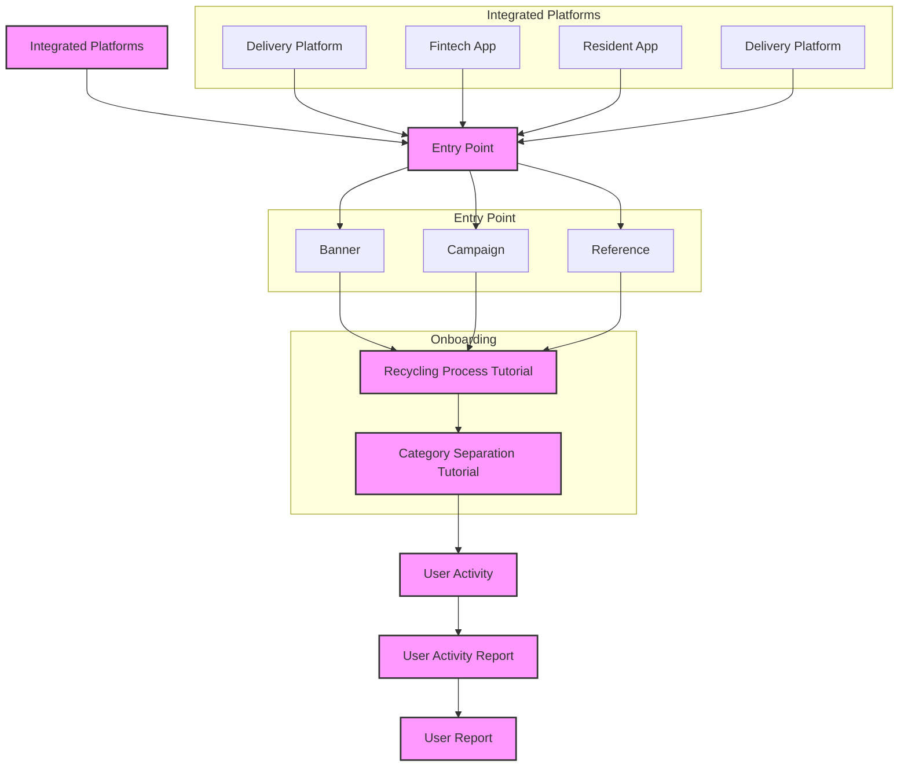

```mermaid

flowchart TD
  A[Integrated Platforms] --> B[Entry Point]
  subgraph Integrated Platforms
    A1[Delivery Platform]
    A2[Fintech App]
    A3[Resident App]
    A4[Delivery Platform]
  end
  A1 --> B
  A2 --> B
  A3 --> B
  A4 --> B

  subgraph Entry Point
    B1[Banner]
    B2[Campaign]
    B3[Reference]
  end
  B --> B1
  B --> B2
  B --> B3
  B1 --> C[Recycling Process Tutorial]
  B2 --> C
  B3 --> C

  subgraph Onboarding
    C --> D[Category Separation Tutorial]
  end

  D --> E[User Activity]
  E --> F[User Activity Report]
  F --> G[User Report]

  classDef phase fill:#f9f,stroke:#333,stroke-width:2px;
  class A,B,C,D,E,F,G phase;

```
