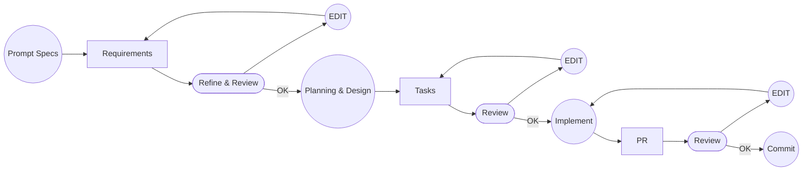

```mermaid
  flowchart LR
  prompt_spec(("Prompt Specs"))
  req["Requirements"]

  prompt_spec --> req
  req --> spec_state(["Refine & Review"])

  spec_state --> spec_prompt_edit(("EDIT"))
  spec_state --OK--> design(("Planning & Design"))

  design --> task["Tasks"]
  task --> task_state(["Review"])

  task_state --> task_edit(("EDIT"))
  task_state --OK--> implement(("Implement"))

  implement --> PR["PR"]
  PR --> implement_state(["Review"])
  implement_state --> implement_edit(("EDIT"))
  implement_state --OK--> commit(("Commit"))
  
  

  spec_prompt_edit --> req
  task_edit --> task
  implement_edit --> implement

```
