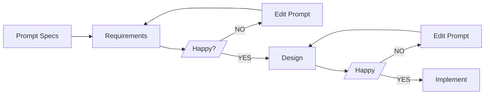

```mermaid
  flowchart LR
  prompt_spec["Prompt Specs"]
  req["Requirements"]

  prompt_spec --> req
  req --> spec_state[/"Happy?"/]
  spec_state --NO--> spec_prompt_edit["Edit Prompt"]
  spec_state --YES--> design["Design"]
  design --> design_state[/"Happy"/]
  design_state --NO--> design_prompt_edit["Edit Prompt"]
  design_state --YES--> implement["Implement"]

  spec_prompt_edit --> req
  design_prompt_edit --> design

```
