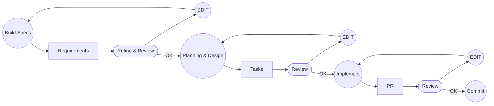

# Software Development Life Cycle

1. Specify
2. Plan
3. Task
4. Implement

# Frameworks:
- OpenSpec - LIGHTWEIGHT
- Speckit (Github) - HEAVY
- Kiro - HEAVY

# Sample Structure
## 1. Why

## 2. What

## 3. Constraint
### i. Must
### ii. Must not
### iii. Out of scope

## 4. Current state

## 5. Tasks
### i. Task 01

- What
- Files
- Tests
- Verify

### ii. Task 02
### iii. Task 01
