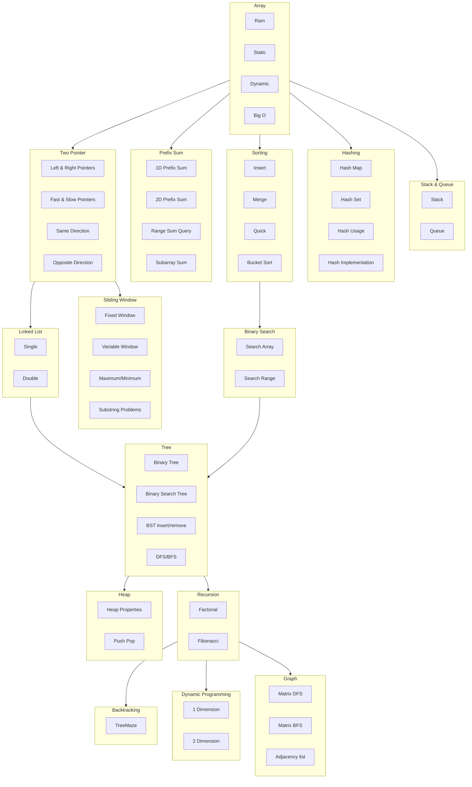

# Learning Map

```mermaid

flowchart TD
    subgraph array["Array"]
        Ram
        Static
        Dynamic
        bigo["Big O"]
    end

    subgraph stack_queue["Stack & Queue"]
        stack["Stack"]
        queue["Queue"]
    end

    subgraph hashing["Hashing"]
        hashmap["Hash Map"]
        hashset["Hash Set"]
        hashusage["Hash Usage"]
        hashimplementation["Hash Implementation"]
    end

    subgraph 2pointer["Two Pointer"]
        lrpointer["Left & Right Pointers"]
        fspointer["Fast & Slow Pointers"]
        samedirection["Same Direction"]
        oppdirection["Opposite Direction"]
    end

    subgraph prefix_sum["Prefix Sum"]
        1d["1D Prefix Sum"]
        2d["2D Prefix Sum"]
        range["Range Sum Query"]
        subarray["Subarray Sum"]
    end

    subgraph sorting["Sorting"]
        insert["Insert"]
        merge["Merge"]
        quick["Quick"]
        bucket["Bucket Sort"]
    end

    subgraph linkedlist["Linked List"]
        Single
        Double
    end

    subgraph slidingwindow["Sliding Window"]
        fixed["Fixed Window"]
        variable["Variable Window"]
        maxmin["Maximum/Minimum"]
        substr["Substring Problems"]
    end

    subgraph binarysearch["Binary Search"]
        searcharr["Search Array"]
        searchrange["Search Range"]
    end

    subgraph tree["Tree"]
        binarytree["Binary Tree"]
        binarysearchtree["Binary Search Tree"]
        bst["BST insert/remove"]
        fs["DFS/BFS"]
    end

    subgraph recursion["Recursion"]
        factorial["Factorial"]
        fibonacci["Fibonacci"]
    end

    subgraph heap["Heap"]
        heapprobperties["Heap Properties"]
        pushpop["Push Pop"]
    end

    subgraph backtracking["Backtracking"]
        TreeMaze
    end

    subgraph dynamicprograming["Dynamic Programming"]
        dynamic.1d["1 Dimension"]
        dynamic.2d["2 Dimension"]
    end

    subgraph grph["Graph"]
        matrixDFS["Matrix DFS"]
        matrixBFS["Matrix BFS"]
        adjlist["Adjacency list"]
    end

    array --> stack_queue
    array --> hashing
    array --> 2pointer
    array --> prefix_sum
    array --> sorting

    2pointer --> linkedlist
    2pointer --> slidingwindow

    sorting --> binarysearch

    linkedlist  --> tree
    binarysearch --> tree

    tree --> recursion
    tree --> heap

    recursion --> backtracking
    recursion --> dynamicprograming
    recursion --> grph


```
