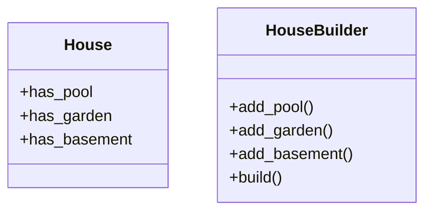

[⬅️ Back to Creational Patterns](/system-design-pattern/creational)

# Builder Pattern

## Định nghĩa
Builder Pattern tách rời quá trình xây dựng một đối tượng phức tạp khỏi biểu diễn của nó, cho phép cùng một quá trình xây dựng có thể tạo ra các biểu diễn khác nhau.

## Mục đích
- Xây dựng đối tượng phức tạp từng bước một.
- Dễ mở rộng, bảo trì khi đối tượng có nhiều thuộc tính tuỳ chọn.

## Ví dụ thực tế
- Xây dựng một đối tượng House với nhiều tuỳ chọn: có bể bơi, có vườn, có tầng hầm...

## Code mẫu (Python)
```python
class House:
    def __init__(self):
        self.has_pool = False
        self.has_garden = False
        self.has_basement = False
class HouseBuilder:
    def __init__(self):
        self.house = House()
    def add_pool(self):
        self.house.has_pool = True
        return self
    def add_garden(self):
        self.house.has_garden = True
        return self
    def add_basement(self):
        self.house.has_basement = True
        return self
    def build(self):
        return self.house
# Sử dụng
builder = HouseBuilder()
house = builder.add_pool().add_garden().build()
print(house.has_pool, house.has_garden, house.has_basement)  # True True False
```

## Diagram


## So sánh với các pattern cùng nhóm
- **Singleton Pattern**: Singleton kiểm soát số lượng instance, Builder tập trung vào quá trình xây dựng đối tượng.
- **Factory Pattern**: Factory tạo đối tượng đơn giản, Builder xây dựng đối tượng phức tạp từng bước.

## Liên kết
- [Quay lại danh sách Creational Patterns](/system-design-pattern/creational)
- [Singleton Pattern](/system-design-pattern/creational/singleton)
- [Factory Pattern](/system-design-pattern/creational/factory) 

[⬅️ Back to Creational Patterns](/system-design-pattern/creational) 