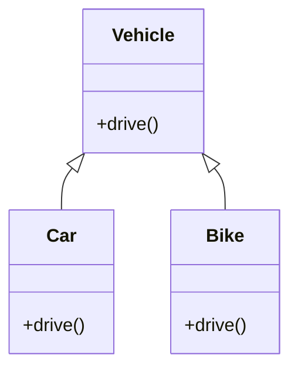

[⬅️ Back to Creational Patterns](/system-design-pattern/creational)

# Factory Pattern

## Định nghĩa
Factory Pattern cung cấp một interface để tạo đối tượng, cho phép các subclass quyết định class nào sẽ được khởi tạo.

## Mục đích
- Ẩn chi tiết khởi tạo đối tượng khỏi client.
- Dễ mở rộng khi thêm loại đối tượng mới.

## Ví dụ thực tế
- Tạo các loại phương tiện: Car, Bike, Truck.
- Tạo các kết nối database khác nhau (MySQL, PostgreSQL, ...).

## Code mẫu (Python)
```python
class Vehicle:
    def drive(self):
        pass
class Car(Vehicle):
    def drive(self):
        print("Driving car")
class Bike(Vehicle):
    def drive(self):
        print("Riding bike")

def vehicle_factory(type):
    if type == "car":
        return Car()
    elif type == "bike":
        return Bike()

v = vehicle_factory("car")
v.drive()  # Driving car
```

## Diagram


## So sánh với các pattern cùng nhóm
- **Singleton Pattern**: Singleton chỉ có một instance, Factory tạo nhiều instance.
- **Builder Pattern**: Builder dùng để xây dựng đối tượng phức tạp, Factory chỉ tạo đối tượng đơn giản.

## Liên kết
- [Quay lại danh sách Creational Patterns](/system-design-pattern/creational)
- [Singleton Pattern](/system-design-pattern/creational/singleton)
- [Builder Pattern](/system-design-pattern/creational/builder) 

[⬅️ Back to Creational Patterns](/system-design-pattern/creational) 