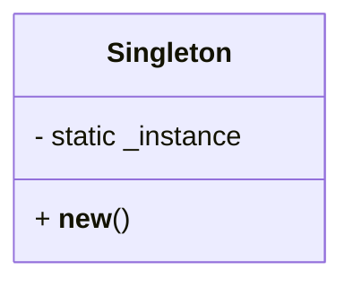

[⬅️ Back to Creational Patterns](/system-design-pattern/creational)

# Singleton Pattern

## Định nghĩa
Singleton Pattern đảm bảo một class chỉ có duy nhất một instance và cung cấp một điểm truy cập toàn cục đến instance đó.

## Mục đích
- Đảm bảo chỉ có một đối tượng duy nhất tồn tại trong suốt vòng đời ứng dụng (ví dụ: config, logger, connection pool).
- Tránh việc tạo nhiều instance gây lãng phí tài nguyên hoặc xung đột trạng thái.

## Ví dụ thực tế
- Logger (ghi log toàn hệ thống)
- Database Connection Pool
- Configuration Manager

## Code mẫu (Python)
```python
class Singleton:
    _instance = None
    def __new__(cls, *args, **kwargs):
        if not cls._instance:
            cls._instance = super().__new__(cls)
        return cls._instance

# Sử dụng
s1 = Singleton()
s2 = Singleton()
print(s1 is s2)  # True
```

## Diagram


## So sánh với các pattern cùng nhóm
- **Factory Pattern**: Factory tạo ra nhiều instance, Singleton chỉ cho phép một instance.
- **Builder Pattern**: Builder dùng để xây dựng đối tượng phức tạp, Singleton kiểm soát số lượng instance.

## Liên kết
- [Quay lại danh sách Creational Patterns](/system-design-pattern/creational)
- [Factory Pattern](/system-design-pattern/creational/factory)
- [Builder Pattern](/system-design-pattern/creational/builder) 

[⬅️ Back to Creational Patterns](/system-design-pattern/creational) 