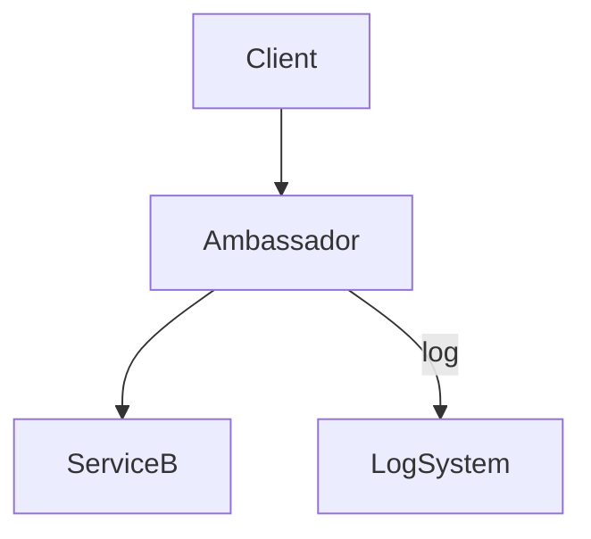

[⬅️ Back to Distributed System Patterns](/system-design-pattern/distributed)

# Ambassador Pattern

## 1. Định nghĩa dễ hiểu
Ambassador Pattern là cách triển khai một proxy (đại sứ) nằm cạnh service chính, giúp xử lý các chức năng như retry, logging, bảo mật, monitoring... mà không cần sửa code service chính.

## 2. Khi nào nên dùng?
- Khi muốn thêm chức năng (retry, logging, auth) cho service mà không sửa code.
- Khi cần tách biệt logic phụ trợ khỏi service chính.

## 3. Lợi ích
- Dễ mở rộng, bảo trì chức năng phụ trợ.
- Có thể tái sử dụng ambassador cho nhiều service.
- Dễ triển khai trên nền tảng container.

## 4. Nhược điểm
- Tăng số lượng process/container cần quản lý.
- Có thể tăng độ trễ (latency) do qua thêm một lớp proxy.

## 5. Ví dụ thực tế step by step
### Bài toán: Thêm chức năng retry và logging cho service B mà không sửa code service B

### Bước 1: Triển khai một container ambassador (proxy) cạnh service B.

### Bước 2: Client gửi request tới ambassador, ambassador sẽ retry nếu service B lỗi, đồng thời ghi log mọi request.

### Bước 3: Khi cần thay đổi logic retry/logging, chỉ cần cập nhật ambassador.

### Bước 4: Code mẫu (Python pseudo)
```python
class AmbassadorProxy:
    def __init__(self, service):
        self.service = service
    def handle_request(self, req):
        for i in range(3):
            try:
                log_request(req)
                return self.service(req)
            except Exception:
                continue
        raise Exception('Service failed after 3 retries')
```

## 6. Diagram


## 7. So sánh với các giải pháp khác
- **Sidecar**: Chạy cùng pod/container, Ambassador thường là proxy phía trước service.
- **API Gateway**: Gateway là entrypoint cho toàn hệ thống, Ambassador là proxy cho từng service.

## 8. Anti-pattern & lưu ý
- Không nên lạm dụng ambassador cho mọi chức năng nhỏ.
- Nên monitor ambassador để tránh bottleneck.

## 9. Câu hỏi phỏng vấn thường gặp
- Ambassador Pattern giải quyết vấn đề gì?
- So sánh Ambassador với Sidecar, API Gateway?
- Khi nào nên dùng Ambassador?

[⬅️ Back to Distributed System Patterns](/system-design-pattern/distributed) 