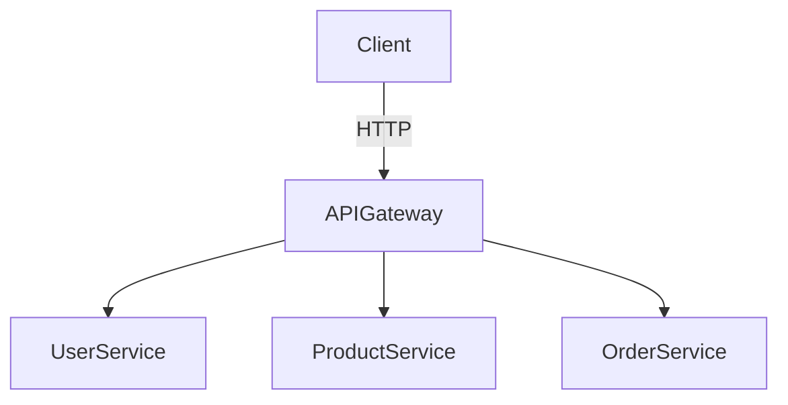

[⬅️ Back to Distributed System Patterns](/system-design-pattern/distributed)

# API Gateway Pattern

## 1. Định nghĩa dễ hiểu
API Gateway là một “cửa ngõ” duy nhất mà mọi request từ client (web, mobile, app) đều phải đi qua trước khi tới các service phía sau. Nó giống như một “lễ tân” ở công ty: khách đến chỉ gặp lễ tân, lễ tân sẽ hướng dẫn, kiểm tra, chuyển tiếp tới đúng phòng ban.

## 2. Khi nào nên dùng?
- Khi hệ thống có nhiều microservice, mỗi service đảm nhiệm một chức năng riêng.
- Khi muốn client chỉ cần biết 1 endpoint duy nhất, không phải nhớ nhiều địa chỉ.
- Khi cần kiểm soát bảo mật, xác thực, logging, rate limiting, caching, tổng hợp dữ liệu từ nhiều service.

## 3. Lợi ích
- Đơn giản hóa client: Client chỉ cần gọi 1 endpoint.
- Bảo mật tập trung: Dễ kiểm soát xác thực, phân quyền.
- Dễ mở rộng: Thêm, sửa, ẩn bớt service phía sau mà client không cần biết.
- Tối ưu hiệu năng: Có thể cache, nén, tổng hợp dữ liệu trước khi trả về client.

## 4. Nhược điểm
- Single Point of Failure: Nếu API Gateway sập, toàn bộ hệ thống không truy cập được.
- Có thể trở thành bottleneck nếu không scale tốt.
- Tăng độ phức tạp vận hành: Cần monitor, scale, bảo trì riêng.

## 5. Ví dụ thực tế step by step
### Bài toán: Xây dựng hệ thống bán hàng online gồm 3 service:
- User Service: Quản lý thông tin người dùng
- Product Service: Quản lý sản phẩm
- Order Service: Quản lý đơn hàng

**Yêu cầu:** Client chỉ gọi 1 endpoint duy nhất, API Gateway sẽ chuyển tiếp request tới đúng service.

### Bước 1: Thiết kế API Gateway
- Định nghĩa các route:
  - `/api/users` → chuyển tới User Service
  - `/api/products` → chuyển tới Product Service
  - `/api/orders` → chuyển tới Order Service

### Bước 2: Cài đặt API Gateway (Python Flask)
```python
from flask import Flask, request, jsonify
import requests
app = Flask(__name__)
USER_SERVICE_URL = 'http://localhost:5001'
PRODUCT_SERVICE_URL = 'http://localhost:5002'
ORDER_SERVICE_URL = 'http://localhost:5003'
@app.route('/api/users')
def users():
    resp = requests.get(f'{USER_SERVICE_URL}/users')
    return jsonify(resp.json())
@app.route('/api/products')
def products():
    resp = requests.get(f'{PRODUCT_SERVICE_URL}/products')
    return jsonify(resp.json())
@app.route('/api/orders')
def orders():
    resp = requests.get(f'{ORDER_SERVICE_URL}/orders')
    return jsonify(resp.json())
```

### Bước 3: Client chỉ cần gọi `/api/users`, `/api/products`, `/api/orders` mà không cần biết các service phía sau chạy ở đâu, port nào.

### Bước 4: Thêm xác thực, logging, rate limiting vào API Gateway nếu cần.

## 6. Diagram


## 7. So sánh với các giải pháp khác
- **Direct Client-to-Service**: Client gọi trực tiếp từng service → khó bảo mật, khó quản lý, client phải biết nhiều endpoint.
- **Backend-for-Frontend (BFF)**: Mỗi loại client (web, mobile) có một gateway riêng, tối ưu cho từng loại giao diện.

## 8. Anti-pattern & lưu ý
- Đừng để API Gateway xử lý quá nhiều logic nghiệp vụ (nên chỉ routing, xác thực, tổng hợp dữ liệu).
- Luôn có cơ chế scale, monitor, fallback cho gateway.

## 9. Câu hỏi phỏng vấn thường gặp
- API Gateway giải quyết vấn đề gì?
- So sánh API Gateway với Service Mesh?
- Làm sao để tránh bottleneck ở API Gateway?

[⬅️ Back to Distributed System Patterns](/system-design-pattern/distributed) 