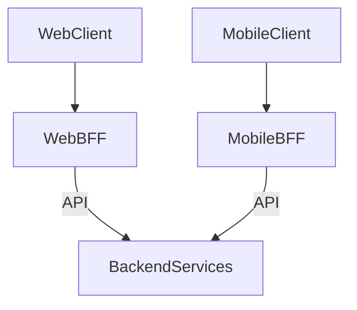

[⬅️ Back to Distributed System Patterns](/system-design-pattern/distributed)

# Backend-for-Frontend (BFF) Pattern

## 1. Định nghĩa dễ hiểu
BFF Pattern là cách xây dựng một backend riêng cho từng loại client (web, mobile, desktop), giúp tối ưu hóa API, logic, dữ liệu cho từng giao diện.

## 2. Khi nào nên dùng?
- Khi có nhiều loại client với nhu cầu dữ liệu khác nhau.
- Khi muốn tối ưu hiệu năng, bảo mật, trải nghiệm cho từng loại client.

## 3. Lợi ích
- Tối ưu hóa API, logic cho từng client.
- Dễ bảo trì, phát triển độc lập từng frontend.
- Giảm phức tạp cho client, tăng bảo mật.

## 4. Nhược điểm
- Tăng số lượng backend cần quản lý.
- Có thể trùng lặp logic giữa các BFF.

## 5. Ví dụ thực tế step by step
### Bài toán: Hệ thống có web app và mobile app, mỗi loại cần dữ liệu khác nhau

### Bước 1: Xây dựng 2 BFF riêng biệt: Web BFF và Mobile BFF
- Web BFF: Tối ưu cho giao diện web, trả về nhiều dữ liệu, nhiều trường.
- Mobile BFF: Tối ưu cho mobile, trả về ít dữ liệu, nén nhỏ, đơn giản hóa logic.

### Bước 2: Client web gọi Web BFF, client mobile gọi Mobile BFF.

### Bước 3: Mỗi BFF sẽ gọi tới các service backend chung (user, order, product, ...).

### Bước 4: Code mẫu (Python pseudo)
```python
# Web BFF
@app.route('/web/user')
def web_user():
    user = get_user()
    return {'name': user.name, 'email': user.email, 'address': user.address}

# Mobile BFF
@app.route('/mobile/user')
def mobile_user():
    user = get_user()
    return {'name': user.name}
```

## 6. Diagram


## 7. So sánh với các giải pháp khác
- **API Gateway**: Một entrypoint cho mọi client, BFF tách riêng cho từng loại client.
- **Monolithic Backend**: Một backend chung cho mọi client, khó tối ưu hóa.

## 8. Anti-pattern & lưu ý
- Không nên lạm dụng BFF nếu client không khác biệt nhiều.
- Nên chia sẻ logic chung qua service backend, tránh trùng lặp code giữa các BFF.

## 9. Câu hỏi phỏng vấn thường gặp
- BFF Pattern giải quyết vấn đề gì?
- Khi nào nên dùng BFF thay vì API Gateway?
- Làm sao để tránh trùng lặp logic giữa các BFF?

[⬅️ Back to Distributed System Patterns](/system-design-pattern/distributed) 