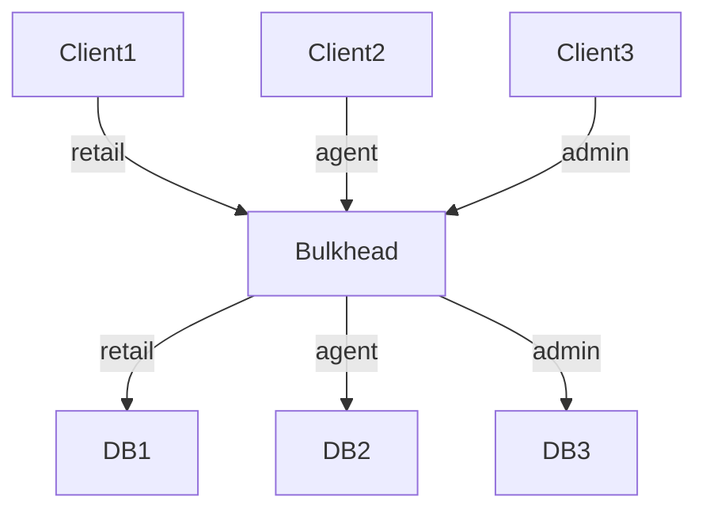

[⬅️ Back to Distributed System Patterns](/system-design-pattern/distributed)

# Bulkhead Pattern

## 1. Định nghĩa dễ hiểu
Bulkhead Pattern chia hệ thống thành các vùng (compartment) độc lập, giống như các khoang kín trên tàu thủy. Nếu một khoang bị ngập nước, các khoang khác vẫn an toàn, giúp hệ thống không bị sập toàn bộ khi một phần gặp sự cố.

## 2. Khi nào nên dùng?
- Khi hệ thống có nhiều thành phần/phân vùng phục vụ các nhóm user khác nhau.
- Khi muốn giới hạn tác động của lỗi (ví dụ: chỉ một nhóm user bị ảnh hưởng).
- Khi cần tăng độ ổn định, khả năng phục hồi.

## 3. Lợi ích
- Ngăn lỗi lan rộng toàn hệ thống.
- Tăng độ ổn định, khả năng phục hồi.
- Dễ monitor, cô lập sự cố.

## 4. Nhược điểm
- Tăng độ phức tạp thiết kế.
- Có thể lãng phí tài nguyên nếu phân vùng không hợp lý.

## 5. Ví dụ thực tế step by step
### Bài toán: Hệ thống đặt vé chia thành 3 pool kết nối DB cho 3 nhóm user: khách lẻ, đại lý, admin.

### Bước 1: Thiết kế 3 pool kết nối riêng biệt.
- Pool 1: chỉ phục vụ khách lẻ
- Pool 2: chỉ phục vụ đại lý
- Pool 3: chỉ phục vụ admin

### Bước 2: Khi pool của khách lẻ bị đầy/lỗi, đại lý và admin vẫn truy cập bình thường.

### Bước 3: Code mẫu (Python pseudo)
```python
class Bulkhead:
    def __init__(self):
        self.pools = {
            'retail': ConnectionPool(size=10),
            'agent': ConnectionPool(size=5),
            'admin': ConnectionPool(size=2)
        }
    def get_connection(self, user_type):
        return self.pools[user_type].get()
```

## 6. Diagram


## 7. So sánh với các giải pháp khác
- **Circuit Breaker**: Ngắt mạch khi lỗi, Bulkhead cô lập vùng lỗi.
- **Rate Limiter**: Giới hạn số request, Bulkhead giới hạn phạm vi ảnh hưởng.

## 8. Anti-pattern & lưu ý
- Không nên chia quá nhỏ gây lãng phí tài nguyên.
- Nên monitor từng bulkhead để phát hiện sớm sự cố.

## 9. Câu hỏi phỏng vấn thường gặp
- Bulkhead Pattern giải quyết vấn đề gì?
- So sánh Bulkhead với Circuit Breaker?
- Khi nào nên dùng Bulkhead?

[⬅️ Back to Distributed System Patterns](/system-design-pattern/distributed) 