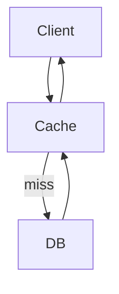

[⬅️ Back to Distributed System Patterns](/system-design-pattern/distributed)

# Cache-Aside Pattern

## 1. Định nghĩa dễ hiểu
Cache-Aside (Lazy Loading) là pattern giúp tăng tốc truy xuất dữ liệu bằng cách chỉ lấy dữ liệu từ cache nếu có, nếu không thì lấy từ database rồi lưu vào cache cho lần sau.

## 2. Khi nào nên dùng?
- Khi dữ liệu đọc nhiều hơn ghi.
- Khi muốn giảm tải cho database.
- Khi cần tăng tốc độ phản hồi cho user.

## 3. Lợi ích
- Giảm tải cho database.
- Tăng tốc độ truy xuất dữ liệu.
- Dễ triển khai, không phụ thuộc vào công nghệ cache cụ thể.

## 4. Nhược điểm
- Dữ liệu cache có thể bị lỗi thời (stale data).
- Cần xử lý đồng bộ cache khi dữ liệu thay đổi.

## 5. Ví dụ thực tế step by step
### Bài toán: Lấy thông tin sản phẩm theo product_id

### Bước 1: Client gửi request lấy product_id=123
- Kiểm tra cache: nếu có, trả về luôn.
- Nếu không có, truy vấn DB, lưu vào cache, trả về client.

### Bước 2: Khi cập nhật sản phẩm, xóa cache hoặc cập nhật lại cache.

### Bước 3: Code mẫu (Python)
```python
cache = {}
def get_product(product_id):
    if product_id in cache:
        return cache[product_id]
    product = db.query('SELECT * FROM products WHERE id=?', (product_id,))
    cache[product_id] = product
    return product
```

## 6. Diagram


## 7. So sánh với các giải pháp khác
- **Write-Through Cache**: Ghi vào cache và DB cùng lúc, Cache-Aside chỉ ghi cache khi đọc miss.
- **Read-Through Cache**: Cache tự động lấy từ DB khi miss, Cache-Aside do app chủ động lấy.

## 8. Anti-pattern & lưu ý
- Không nên cache dữ liệu thay đổi liên tục.
- Nên đặt TTL (time-to-live) cho cache để tránh stale data.

## 9. Câu hỏi phỏng vấn thường gặp
- Cache-Aside Pattern giải quyết vấn đề gì?
- So sánh Cache-Aside với Write-Through, Read-Through?
- Làm sao để đồng bộ cache khi dữ liệu thay đổi?

[⬅️ Back to Distributed System Patterns](/system-design-pattern/distributed) 