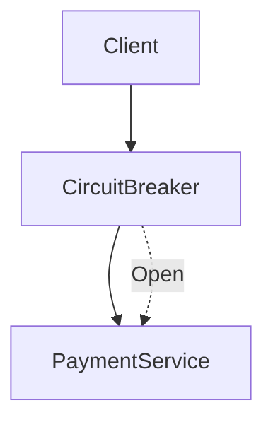

[⬅️ Back to Distributed System Patterns](/system-design-pattern/distributed)

# Circuit Breaker Pattern

## 1. Định nghĩa dễ hiểu
Circuit Breaker (CB) là một cơ chế bảo vệ hệ thống khỏi việc gọi liên tục tới một service đang gặp sự cố. Nó giống như cầu dao điện: khi phát hiện lỗi liên tục, CB sẽ "ngắt mạch" tạm thời, không cho phép gọi tiếp, giúp hệ thống không bị quá tải dây chuyền.

## 2. Khi nào nên dùng?
- Khi hệ thống có nhiều service phụ thuộc lẫn nhau.
- Khi một service có thể bị quá tải hoặc lỗi tạm thời.
- Khi muốn tăng độ ổn định, tự phục hồi cho hệ thống phân tán.

## 3. Lợi ích
- Bảo vệ hệ thống khỏi bị sập dây chuyền.
- Giảm tải cho service đang gặp sự cố.
- Tăng khả năng tự phục hồi.

## 4. Nhược điểm
- Nếu cấu hình không hợp lý, có thể ngắt mạch quá sớm hoặc quá muộn.
- Tăng độ phức tạp vận hành, cần monitor trạng thái CB.

## 5. Ví dụ thực tế step by step
### Bài toán: Hệ thống đặt vé gọi tới Payment Service
- Nếu Payment Service bị lỗi liên tục, Circuit Breaker sẽ ngắt mạch, không gọi nữa trong một thời gian.

### Bước 1: Cài đặt Circuit Breaker
- Theo dõi số lần lỗi liên tiếp khi gọi Payment Service.
- Nếu lỗi vượt ngưỡng (ví dụ 3 lần), chuyển sang trạng thái "OPEN" (ngắt mạch).
- Sau một thời gian chờ (timeout), thử gọi lại ("HALF-OPEN"). Nếu thành công, đóng mạch lại ("CLOSED").

### Bước 2: Code mẫu (Python)
```python
class CircuitBreaker:
    def __init__(self, max_failures=3, reset_timeout=60):
        self.max_failures = max_failures
        self.reset_timeout = reset_timeout
        self.failure_count = 0
        self.state = 'CLOSED'
        self.last_failure_time = None
    def call(self, func, *args, **kwargs):
        import time
        if self.state == 'OPEN':
            if time.time() - self.last_failure_time > self.reset_timeout:
                self.state = 'HALF-OPEN'
            else:
                raise Exception('Circuit is open')
        try:
            result = func(*args, **kwargs)
            self.failure_count = 0
            self.state = 'CLOSED'
            return result
        except Exception:
            self.failure_count += 1
            self.last_failure_time = time.time()
            if self.failure_count >= self.max_failures:
                self.state = 'OPEN'
            raise
```

### Bước 3: Khi Payment Service ổn định lại, CB sẽ tự động đóng mạch, cho phép gọi tiếp.

## 6. Diagram


## 7. So sánh với các giải pháp khác
- **Retry Pattern**: Chỉ thử lại khi lỗi, không ngắt mạch. CB giúp tránh retry quá nhiều khi service đã "chết".
- **Timeout**: Dừng chờ khi quá lâu, nhưng không ngăn gọi tiếp như CB.

## 8. Anti-pattern & lưu ý
- Không nên dùng CB cho các thao tác không quan trọng (có thể retry nhẹ).
- Luôn monitor trạng thái CB để phát hiện vấn đề sớm.

## 9. Câu hỏi phỏng vấn thường gặp
- Circuit Breaker giải quyết vấn đề gì?
- Sự khác biệt giữa Circuit Breaker và Retry?
- Khi nào nên reset CB về trạng thái CLOSED?

[⬅️ Back to Distributed System Patterns](/system-design-pattern/distributed) 