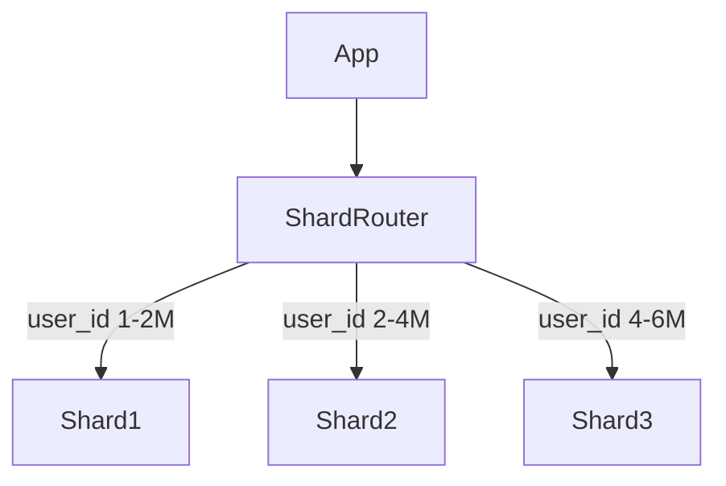

[⬅️ Back to Distributed System Patterns](/system-design-pattern/distributed)

# Database Sharding Pattern

## 1. Định nghĩa dễ hiểu
Database Sharding là cách chia nhỏ database thành nhiều phần (shard) nhỏ hơn, mỗi shard chứa một phần dữ liệu, giúp tăng hiệu năng và khả năng mở rộng. Giống như chia một cuốn sách dày thành nhiều tập nhỏ.

## 2. Khi nào nên dùng?
- Khi database quá lớn, ảnh hưởng tới hiệu năng.
- Khi cần tăng khả năng mở rộng theo chiều ngang (horizontal scaling).
- Khi muốn phân tán tải cho database.

## 3. Lợi ích
- Tăng hiệu năng truy vấn (query performance).
- Tăng khả năng mở rộng.
- Giảm tải cho từng database instance.

## 4. Nhược điểm
- Tăng độ phức tạp quản lý, vận hành.
- Khó thực hiện join query giữa các shard.
- Cần xử lý phân phối dữ liệu, rebalancing.

## 5. Ví dụ thực tế step by step
### Bài toán: Hệ thống e-commerce có 10 triệu user, cần chia database để tăng hiệu năng

### Bước 1: Chọn sharding key (ví dụ: user_id)
- Shard 1: user_id từ 1-2 triệu
- Shard 2: user_id từ 2-4 triệu
- Shard 3: user_id từ 4-6 triệu
- ...

### Bước 2: Xây dựng sharding logic
- Khi user login, tính toán user_id thuộc shard nào.
- Gửi query tới đúng shard.

### Bước 3: Code mẫu (Python pseudo)
```python
def get_shard(user_id):
    shard_id = (user_id % 5) + 1
    return f'shard_{shard_id}'

def get_user(user_id):
    shard = get_shard(user_id)
    return query_shard(shard, f'SELECT * FROM users WHERE id={user_id}')
```

## 6. Diagram


## 7. So sánh với các giải pháp khác
- **Replication**: Copy dữ liệu ra nhiều instance, Sharding chia dữ liệu ra nhiều instance.
- **Partitioning**: Chia trong cùng một database, Sharding chia ra nhiều database riêng biệt.

## 8. Anti-pattern & lưu ý
- Không nên shard quá sớm khi dữ liệu chưa đủ lớn.
- Cần chọn sharding key phù hợp để tránh hot spot.

## 9. Câu hỏi phỏng vấn thường gặp
- Database Sharding giải quyết vấn đề gì?
- Khi nào nên dùng Sharding thay vì Replication?
- Làm sao để chọn sharding key phù hợp?

[⬅️ Back to Distributed System Patterns](/system-design-pattern/distributed) 