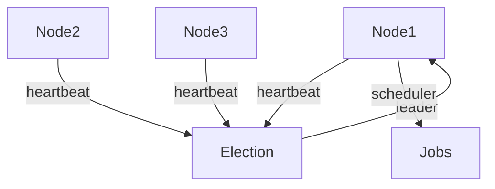

[⬅️ Back to Distributed System Patterns](/system-design-pattern/distributed)

# Leader Election Pattern

## 1. Định nghĩa dễ hiểu
Leader Election Pattern là cách chọn ra một node làm "thủ lĩnh" trong một cluster các node, giúp đảm bảo chỉ có một node thực hiện một tác vụ quan trọng tại một thời điểm. Giống như chọn lớp trưởng trong lớp học.

## 2. Khi nào nên dùng?
- Khi cần đảm bảo chỉ có một node thực hiện tác vụ quan trọng (scheduler, coordinator).
- Khi muốn tăng độ ổn định, khả năng phục hồi cho hệ thống phân tán.

## 3. Lợi ích
- Tránh xung đột khi nhiều node cùng thực hiện một tác vụ.
- Tăng độ ổn định, khả năng phục hồi.
- Dễ quản lý, monitor.

## 4. Nhược điểm
- Tăng độ phức tạp vận hành.
- Cần xử lý trường hợp leader bị lỗi, chọn leader mới.

## 5. Ví dụ thực tế step by step
### Bài toán: Hệ thống có 3 node, cần chọn 1 node làm scheduler để chạy job định kỳ

### Bước 1: Mỗi node tham gia cuộc bầu chọn leader
- Node gửi heartbeat, thông báo mình còn sống.
- Node có ID nhỏ nhất (hoặc theo thuật toán khác) được chọn làm leader.

### Bước 2: Leader thực hiện tác vụ scheduler
- Chỉ leader mới chạy job định kỳ.
- Các node khác standby, sẵn sàng thay thế nếu leader lỗi.

### Bước 3: Khi leader lỗi, các node còn lại bầu chọn leader mới.

### Bước 4: Code mẫu (Python pseudo)
```python
class LeaderElection:
    def __init__(self, node_id):
        self.node_id = node_id
        self.is_leader = False
    def participate_election(self):
        # Gửi heartbeat, tham gia bầu chọn
        if self.win_election():
            self.is_leader = True
            self.run_scheduler()
    def run_scheduler(self):
        if self.is_leader:
            # Chỉ leader mới chạy scheduler
            schedule_jobs()
```

## 6. Diagram


## 7. So sánh với các giải pháp khác
- **Master-Slave**: Cố định master, Leader Election tự động chọn leader.
- **Consensus Algorithm**: Thuật toán đồng thuận phức tạp hơn, Leader Election đơn giản hơn.

## 8. Anti-pattern & lưu ý
- Không nên để leader thực hiện quá nhiều tác vụ quan trọng.
- Cần xử lý split-brain (nhiều leader cùng lúc).

## 9. Câu hỏi phỏng vấn thường gặp
- Leader Election Pattern giải quyết vấn đề gì?
- So sánh Leader Election với Master-Slave?
- Làm sao để xử lý split-brain?

[⬅️ Back to Distributed System Patterns](/system-design-pattern/distributed) 