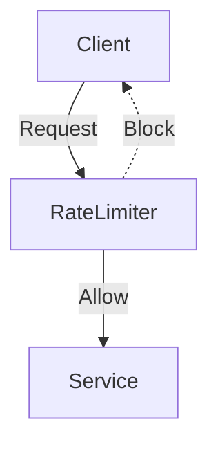

[⬅️ Back to Distributed System Patterns](/system-design-pattern/distributed)

# Rate Limiter Pattern

## 1. Định nghĩa dễ hiểu
Rate Limiter là cơ chế kiểm soát số lượng request mà client có thể gửi tới hệ thống trong một khoảng thời gian nhất định. Giống như bảo vệ ở cổng chỉ cho phép một số lượng người vào công ty mỗi phút.

## 2. Khi nào nên dùng?
- Khi muốn bảo vệ hệ thống khỏi bị spam, tấn công DDoS.
- Khi cần phân phối tài nguyên công bằng cho nhiều client.
- Khi muốn giới hạn số lượng thao tác (API call) của user.

## 3. Lợi ích
- Bảo vệ hệ thống khỏi bị quá tải.
- Đảm bảo tài nguyên được chia đều cho các client.
- Ngăn chặn lạm dụng dịch vụ.

## 4. Nhược điểm
- Nếu cấu hình quá chặt, có thể làm giảm trải nghiệm người dùng.
- Cần lưu trạng thái request của từng client (tăng phức tạp).

## 5. Ví dụ thực tế step by step
### Bài toán: Xây dựng API cho phép mỗi user chỉ được gửi tối đa 5 request/phút.

### Bước 1: Thiết kế Rate Limiter
- Mỗi lần user gửi request, kiểm tra số request đã gửi trong 1 phút qua.
- Nếu chưa vượt quá 5, cho phép tiếp tục. Nếu vượt, trả về lỗi "Too Many Requests".

### Bước 2: Code mẫu (Python)
```python
import time
class RateLimiter:
    def __init__(self, max_requests, window_seconds):
        self.max_requests = max_requests
        self.window_seconds = window_seconds
        self.requests = []
    def allow(self):
        now = time.time()
        self.requests = [r for r in self.requests if now - r < self.window_seconds]
        if len(self.requests) < self.max_requests:
            self.requests.append(now)
            return True
        return False
```

### Bước 3: Khi user gửi request thứ 6 trong 1 phút, hệ thống sẽ từ chối.

## 6. Diagram


## 7. So sánh với các giải pháp khác
- **Token Bucket, Leaky Bucket**: Các thuật toán khác nhau để implement rate limiting.
- **Quota**: Giới hạn tổng số request trong 1 ngày/tháng, Rate Limiter thường giới hạn theo thời gian ngắn hơn.

## 8. Anti-pattern & lưu ý
- Không nên đặt limit quá thấp gây khó chịu cho user.
- Nên thông báo rõ lý do khi bị giới hạn.

## 9. Câu hỏi phỏng vấn thường gặp
- Rate Limiter giải quyết vấn đề gì?
- Có những thuật toán nào để implement Rate Limiter?
- Làm sao để scale Rate Limiter cho hệ thống phân tán?

[⬅️ Back to Distributed System Patterns](/system-design-pattern/distributed) 