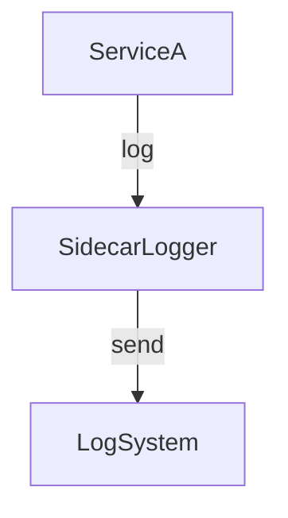

[⬅️ Back to Distributed System Patterns](/system-design-pattern/distributed)

# Sidecar Pattern

## 1. Định nghĩa dễ hiểu
Sidecar Pattern là cách triển khai một chức năng phụ trợ (logging, monitoring, proxy, ...) cùng với service chính, nhưng tách biệt thành một process/container riêng, giống như xe máy có thùng phụ (sidecar).

## 2. Khi nào nên dùng?
- Khi muốn bổ sung chức năng (log, monitor, bảo mật) mà không sửa code service chính.
- Khi cần tái sử dụng chức năng phụ cho nhiều service.

## 3. Lợi ích
- Tách biệt rõ ràng giữa logic chính và phụ trợ.
- Dễ tái sử dụng, bảo trì, nâng cấp chức năng phụ.
- Dễ triển khai trên nền tảng container (Kubernetes).

## 4. Nhược điểm
- Tăng số lượng process/container cần quản lý.
- Có thể tăng độ phức tạp vận hành.

## 5. Ví dụ thực tế step by step
### Bài toán: Thêm chức năng logging cho service A mà không sửa code service A

### Bước 1: Triển khai service A và một container sidecar (ví dụ: Fluentd) cùng pod (Kubernetes).

### Bước 2: Service A ghi log ra file, sidecar đọc file log và gửi tới hệ thống tập trung.

### Bước 3: Khi cần thay đổi logging, chỉ cần cập nhật sidecar, không ảnh hưởng service A.

### Bước 4: Code mẫu (pseudo)
```yaml
# Kubernetes pod spec
apiVersion: v1
kind: Pod
spec:
  containers:
  - name: service-a
    image: myapp/service-a
  - name: sidecar-logger
    image: fluentd
    volumeMounts:
    - name: log-volume
      mountPath: /logs
  volumes:
  - name: log-volume
    emptyDir: {}
```

## 6. Diagram


## 7. So sánh với các giải pháp khác
- **Embedded Library**: Gắn trực tiếp thư viện logging vào service, khó tái sử dụng. Sidecar tách biệt, dễ dùng lại.

## 8. Anti-pattern & lưu ý
- Không nên lạm dụng sidecar cho mọi chức năng nhỏ.
- Nên monitor tài nguyên sidecar để tránh ảnh hưởng service chính.

## 9. Câu hỏi phỏng vấn thường gặp
- Sidecar Pattern giải quyết vấn đề gì?
- Khi nào nên dùng sidecar thay vì embedded library?
- Làm sao để quản lý sidecar hiệu quả trên Kubernetes?

[⬅️ Back to Distributed System Patterns](/system-design-pattern/distributed) 