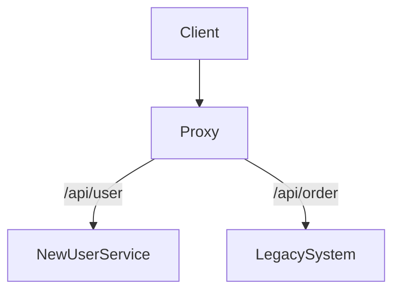

[⬅️ Back to Distributed System Patterns](/system-design-pattern/distributed)

# Strangler Fig Pattern

## 1. Định nghĩa dễ hiểu
Strangler Fig Pattern là cách chuyển đổi hệ thống cũ sang hệ thống mới một cách an toàn, bằng cách dần dần thay thế từng phần nhỏ, giống như cây si strangler mọc bao quanh và thay thế cây chủ.

## 2. Khi nào nên dùng?
- Khi cần refactor, migrate hệ thống lớn mà không thể dừng toàn bộ để thay mới.
- Khi muốn giảm rủi ro khi chuyển đổi hệ thống.

## 3. Lợi ích
- Giảm rủi ro khi chuyển đổi hệ thống.
- Có thể rollback dễ dàng nếu có lỗi.
- Không ảnh hưởng tới user cuối.

## 4. Nhược điểm
- Tăng độ phức tạp vận hành (phải duy trì song song 2 hệ thống).
- Cần kiểm soát routing, đồng bộ dữ liệu.

## 5. Ví dụ thực tế step by step
### Bài toán: Chuyển đổi hệ thống bán hàng cũ (monolith) sang microservices

### Bước 1: Đặt một lớp routing (proxy/API Gateway) trước hệ thống cũ.
- Tất cả request đều đi qua lớp này.

### Bước 2: Viết mới từng module (ví dụ: module user, order) dưới dạng microservice.
- Khi module mới sẵn sàng, routing chuyển request tới service mới, các phần còn lại vẫn chuyển về hệ thống cũ.

### Bước 3: Lặp lại cho tới khi toàn bộ hệ thống đã được thay thế.

### Bước 4: Gỡ bỏ hệ thống cũ, chỉ giữ lại hệ thống mới.

### Bước 5: Code mẫu (pseudo)
```python
# Pseudo code cho routing
if path.startswith('/api/user'):
    forward_to('new_user_service')
else:
    forward_to('legacy_system')
```

## 6. Diagram


## 7. So sánh với các giải pháp khác
- **Big Bang Rewrite**: Thay mới toàn bộ một lần, rủi ro cao. Strangler Fig thay từng phần nhỏ, an toàn hơn.

## 8. Anti-pattern & lưu ý
- Không nên kéo dài quá lâu giai đoạn song song.
- Cần test kỹ từng bước chuyển đổi.

## 9. Câu hỏi phỏng vấn thường gặp
- Strangler Fig Pattern giải quyết vấn đề gì?
- Khi nào nên dùng Strangler Fig thay vì Big Bang Rewrite?
- Làm sao để đảm bảo dữ liệu đồng bộ khi chuyển đổi?

[⬅️ Back to Distributed System Patterns](/system-design-pattern/distributed) 