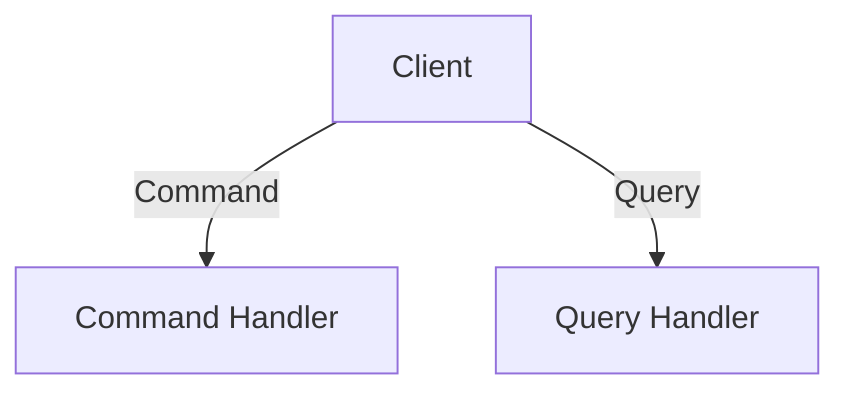

[⬅️ Back to Enterprise Application Patterns](/system-design-pattern/enterprise)

# CQRS Pattern

## Định nghĩa
CQRS (Command Query Responsibility Segregation) tách biệt rõ ràng hai phần: Command (ghi/chỉnh sửa dữ liệu) và Query (đọc dữ liệu).

## Mục đích
- Tối ưu hiệu năng cho từng loại thao tác.
- Dễ mở rộng, scale độc lập.
- Đơn giản hóa logic nghiệp vụ phức tạp.

## Ví dụ thực tế
- Hệ thống ngân hàng, thương mại điện tử lớn.

## Code mẫu (Python)
```python
class CommandHandler:
    def handle(self, command):
        # Xử lý ghi dữ liệu
        pass
class QueryHandler:
    def handle(self, query):
        # Xử lý đọc dữ liệu
        pass
```

## Diagram


[⬅️ Back to Enterprise Application Patterns](/system-design-pattern/enterprise) 