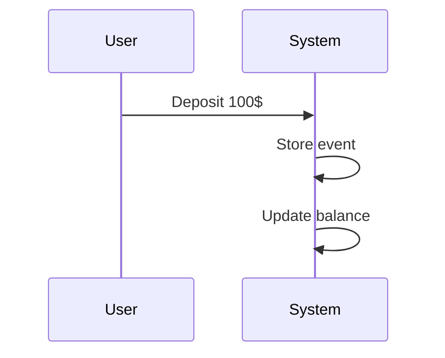

[⬅️ Back to Enterprise Application Patterns](/system-design-pattern/enterprise)

# Event Sourcing Pattern

## Định nghĩa
Event Sourcing lưu trữ trạng thái hệ thống bằng cách ghi lại toàn bộ các sự kiện (event) đã xảy ra thay vì chỉ lưu trạng thái cuối cùng.

## Mục đích
- Audit, trace, rollback dễ dàng.
- Phục hồi trạng thái hệ thống từ event log.
- Hỗ trợ các hệ thống phức tạp, nhiều nghiệp vụ.

## Ví dụ thực tế
- Lưu lịch sử giao dịch ngân hàng, đơn hàng, trạng thái tài khoản.

## Code mẫu (Python)
```python
class Account:
    def __init__(self):
        self.events = []
        self.balance = 0
    def apply(self, event):
        self.events.append(event)
        if event['type'] == 'deposit':
            self.balance += event['amount']
        elif event['type'] == 'withdraw':
            self.balance -= event['amount']
```

## Diagram


[⬅️ Back to Enterprise Application Patterns](/system-design-pattern/enterprise) 