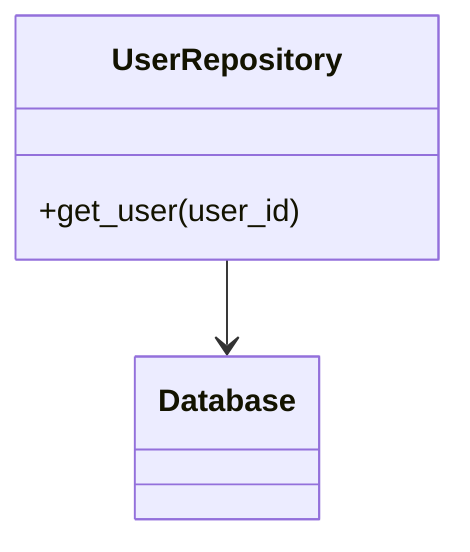

[⬅️ Back to Enterprise Application Patterns](/system-design-pattern/enterprise)

# Repository Pattern

## Định nghĩa
Repository Pattern là một lớp trung gian giữa tầng business logic và tầng dữ liệu, giúp tách biệt logic truy xuất dữ liệu khỏi logic nghiệp vụ.

## Mục đích
- Đơn giản hóa việc truy xuất dữ liệu.
- Dễ dàng thay đổi nguồn dữ liệu (database, API, file, ...).
- Tăng khả năng test và bảo trì.

## Ví dụ thực tế
- Repository cho User, Product, Order trong hệ thống e-commerce.

## Code mẫu (Python)
```python
class UserRepository:
    def __init__(self, db):
        self.db = db
    def get_user(self, user_id):
        return self.db.query('SELECT * FROM users WHERE id=?', (user_id,))
```

## Diagram


[⬅️ Back to Enterprise Application Patterns](/system-design-pattern/enterprise) 