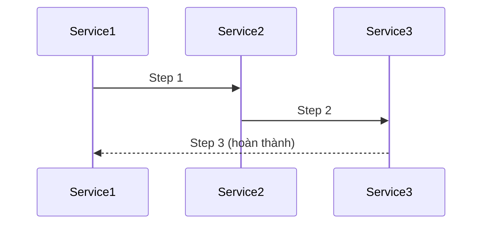

[⬅️ Back to Enterprise Application Patterns](/system-design-pattern/enterprise)

# Saga Pattern

## Định nghĩa
Saga Pattern chia nhỏ một giao dịch lớn thành nhiều bước nhỏ (local transaction), mỗi bước có thể rollback độc lập nếu có lỗi.

## Mục đích
- Đảm bảo tính nhất quán dữ liệu phân tán.
- Hỗ trợ giao dịch nhiều service (microservices).

## Ví dụ thực tế
- Đặt vé máy bay, khách sạn, thanh toán trong một hệ thống booking.

## Code mẫu (Python)
```python
class Saga:
    def __init__(self):
        self.steps = []
    def add_step(self, step):
        self.steps.append(step)
    def execute(self):
        for step in self.steps:
            try:
                step()
            except Exception:
                self.rollback()
                break
    def rollback(self):
        # rollback các bước đã thực hiện
        pass
```

## Diagram


[⬅️ Back to Enterprise Application Patterns](/system-design-pattern/enterprise) 