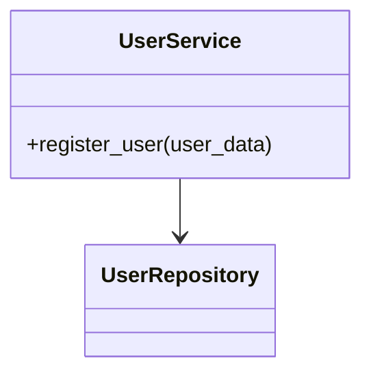

[⬅️ Back to Enterprise Application Patterns](/system-design-pattern/enterprise)

# Service Layer Pattern

## Định nghĩa
Service Layer Pattern gom nhóm các logic nghiệp vụ liên quan vào một lớp (service), giúp tách biệt business logic khỏi controller/UI.

## Mục đích
- Tăng khả năng tái sử dụng và bảo trì code.
- Đơn giản hóa controller/UI.
- Dễ test và mở rộng.

## Ví dụ thực tế
- UserService, OrderService trong hệ thống bán hàng.

## Code mẫu (Python)
```python
class UserService:
    def __init__(self, user_repo):
        self.user_repo = user_repo
    def register_user(self, user_data):
        # validate, gửi email, lưu user...
        self.user_repo.save(user_data)
```

## Diagram


[⬅️ Back to Enterprise Application Patterns](/system-design-pattern/enterprise) 